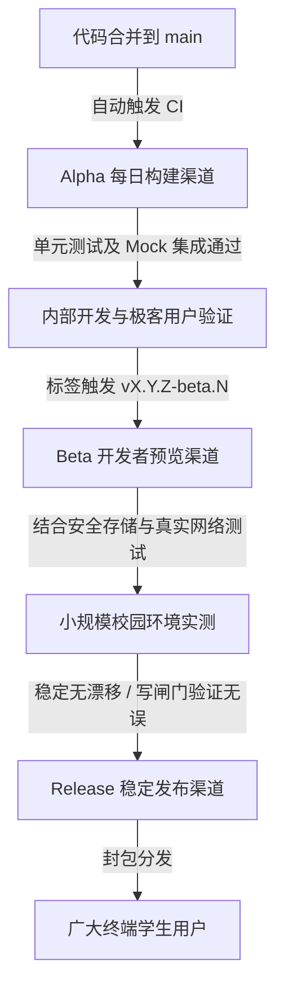

# UBAA Next 发布渠道与分发计划 (Release Channel Plan)

> 当前仓库版本阶段为 `v0.4.0`，尚未形成 0.1/0.2/0.3/0.4 的正式 tag 发布序列。本页描述 v0.5+ 到 v1.0 的发布渠道目标，不代表 v0.4 当前已有稳定分发渠道。

为了保障 UBAA Next 客户端在多个校园服务平台（Windows CLI 命令行、Windows Slint GUI 图形界面、HarmonyOS ArkUI 手机应用）上的发布稳定性，项目采用系统化的多通道版本演进机制。本篇发布计划详细阐述了三个主要的发布渠道、版本命名规范、编译门禁、平台打包与分发策略。

---

## 1. 发布渠道生命周期 (Release Channels)

UBAA Next 实施经典的“**Alpha（每日构建/内测）** ➔ **Beta（公开测试/预览）** ➔ **Release（稳定生产版）**”三级演进链路，分别对应不同的用户群体和风险敞口。

### 1.1 Alpha 渠道 (Nightly / Internal Canary)
*   **定位**：极客内测与持续集成验证版本。由 CI/CD 自动管道在每次代码合并至主干 `main` 分支时自动触发编译产出。
*   **目标群体**：核心开发团队、平台适配器集成人员、愿意承担闪退风险的尝鲜用户。
*   **功能规范**：
    *   **完整保留 Mock 路由**：`UBAANEXT_ENABLE_MOCKS=ON`。可离线对任意底层教务接口进行数据仿真。
    *   **启用高级诊断**：日志系统处于最高精细度，记录全部网络报文结构（除去明文密码与持久化凭据等最高等级敏感数据之外的诊断报文）。
    *   **使用普通开发明文存储**：`PlainFileStore` 可以明文落地临时 session 信息，便于在不同虚拟机或调试环境下迁移与跟踪状态。
*   **分发形式**：GitHub Actions 运行产物归档、Windows 便携式压缩包 (Zip)。

### 1.2 Beta 渠道 (Developer Preview / Pre-release)
*   **定位**：小规模实测与多终端能力验证版本。当核心功能阶段性封版，或架构发生重大变更（如 C ABI 或 NAPI 绑定重构）时发布。
*   **目标群体**：高校开发者、部分邀约测试学生、开源贡献者。
*   **功能规范**：
    *   **限制 Mock 路由**：虽然物理代码中保留 Mock 实现，但通过命令行参数和 UI 引导用户优先接入真实校园网。
    *   **真实网络安全性校验**：强行验证平台物理安全存储适配器（Windows DPAPI、Linux Secret Service、HarmonyOS 安全密钥服务）。如果底层检测到不支持安全存储，直接发出警报并不允许保存真实登录状态。
    *   **部分日志脱敏**：正式启用敏感日志拦截器，任何涉及 Cookie、Authorization 头部、签名哈希的敏感字段都以 `[REDACTED]` 样式隐藏。
*   **分发形式**：GitHub Releases 标记为 `Pre-release`、HarmonyOS 应用内测包。

### 1.3 Release 渠道 (Stable Release)
*   **定位**：最终面向广大普通学生的正式商业/稳定发布版本。每一个主版本（如 `v1.0.0`）的发布都必须通过严苛的手工测试清单与全部线上自动回归测试用例。
*   **目标群体**：全体校园终端学生用户。
*   **安全防范与硬门禁**：
    *   **物理剥离 Mock 测试控制器**：在构建 Release 渠道安装包时，必须使用硬性编译选项 `-DUBAANEXT_ENABLE_MOCKS=OFF`。底层 mock 网络客户端 `MockHttpClient` 以及测试桩将不会被链接进可执行程序，**从物理上杜绝通过 Mock 注入绕过真实登录与风控的行为**。
    *   **严格防范凭据漂移与越权**：强制启用 `WriteOperationGate`（写闸门）。对博雅选课、体育馆场馆预订、座位预约等行为，必须同时满足“用户 `--confirm` 授权验证”和“平台环境确认安全”两个条件。
    *   **极致日志脱敏**：完全关闭 Trace 诊断级别的日志输出，Info/Error 日志中绝对禁止存在任何用户凭据和隐私记录。
*   **分发形式**：GitHub Stable Releases、打包安装程序 (MSI)、HarmonyOS 分发中心。

---

## 2. 版本号规范与控制系统 (Versioning)

UBAA Next 遵循 **语义化版本 2.0.0 (SemVer)** 规范来标记与控制版本号：
`v<主版本号>.<次版本号>.<修订号>[-<预发布版本标识>.<编译版本号>]`

1.  **主版本号 (Major)**：架构或核心公共 API 发生不兼容的重大变更（例如重构 C++ Core 与 NAPI 通信边界，导致旧版 ArkUI 壳无法运行）。
2.  **次版本号 (Minor)**：在保持底层 ABI 与 API 兼容的前提下，增加了新的功能服务（例如新增希冀作业批处理或阳光打卡支持）。
3.  **修订号 (Patch)**：纯粹的内部 Bug 修复、校园教务接口结构变更带来的解析器微调。

### 2.1 针对不同发布渠道的版本号样式示例
*   **Alpha 每日构建**：`v0.4.1-alpha.20260528` (修订版 0.4.1 的内测版，带时间戳编译标识)
*   **Beta 开发者预览**：`v0.4.0-beta.2` (次版本 0.4.0 的第 2 版公开测试)
*   **Stable 稳定发布**：`v1.0.0` (最终的 1.0.0 稳定正式版)

### 2.2 构建系统版本注入机制
在 CMake 配置阶段，主版本号会被统一写入根项目的 `project(UBAANext VERSION X.Y.Z)`，并通过 CMake 的配置文件生成机制，动态产生头文件 `Version.hpp`，将 `UBAANEXT_VERSION_STRING` 宏注入给 CLI 的 `version` 子命令和各 GUI 的关于页面，保证版本源的唯一与绝对同步。

---

## 3. 平台分发与包格式规范

为了在不同平台上提供原生、无缝的安装和运行体验，UBAA Next 对分发包格式有严格的规范。

### 3.1 Windows 平台 (CLI 与 Slint GUI)
1.  **免安装绿色便携包 (Portable Zip)**：
    *   **针对对象**：CLI 命令行版本、Slint GUI 便携版。
    *   **规范**：采用 `x64-windows-static` 三角配置静态编译，确保所有三方库（如 OpenSSL、cURL、Slint C++ Runtime）在编译期以 `.lib` 形式全静态融合。输出单一的 `ubaa.exe` 或 `ubaa-gui.exe`，不带任何 `.dll` 依赖，解压即用。
2.  **标准安装程序 (MSI Installer)**：
    *   **针对对象**：面向普通用户的 Slint GUI 安装包。
    *   **规范**：使用 **WiX Toolset** 创建标准的 `.msi` 微软安装脚本。安装程序应自动完成：
        *   将应用主程序放置于 `C:\Program Files\UBAANext`。
        *   创建桌面与开始菜单快捷方式。
        *   将 CLI 所在的安装目录自动写入系统环境变量 `PATH`，以便用户在任意终端中可以直接输入 `ubaa` 命令。
        *   自动创建并锁定局部应用缓存目录 `%LOCALAPPDATA%\UBAANext`。

### 3.2 HarmonyOS 平台 (ArkUI)
1.  **HarmonyOS 软件应用包 (HPK)**：
    *   **规范**：利用 DevEco Studio 将 C++ 绑定的 `.so` 动态共享库（由 `UBAANextNapi` 项目生成）与 ArkTS 前端界面代码、UI 资源打包为标准的 `.hap`（Feature/Entry HAP）或 `.hsp`（Shared Library HSP），最终合并组装为单一的 `.hpk` 应用市场包。
    *   **安全要求**：由于 HarmonyOS 处于高沙箱权限管制状态，`.so` 库的本地 session 存储必须且仅允许挂载在应用受限沙箱路径（通过 Harmony NAPI 上下文传递的 `ctx->filesDir` 目录），杜绝应用间数据越权窃取。
