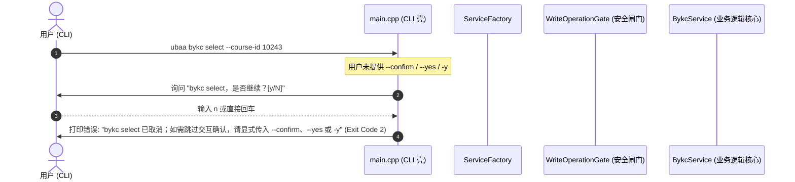
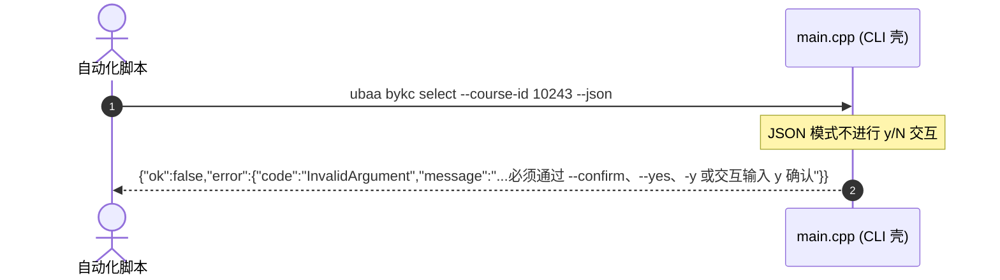
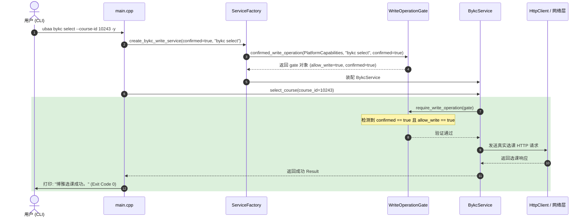

# Windows 命令行应用程序 (ubaa)

> 当前版本阶段：`v0.4.0`。本页记录 CLI 的稳定命令合同和后续规划命令；v0.4 当前基线覆盖 mock/offline、课程/考试/教室/学期/教学周解析与缓存、稳定命令树、统一 JSON envelope、固定 exit code、配置/缓存子命令和 CLI golden 集成测试。真实登录、真实 HTTP 与真实写操作属于 v0.5+ 后续阶段，使用前应以 `ubaa help --json`、测试覆盖和 live smoke 安全门为准。

UBAA Next 命令行接口 (CLI) 是基于 C++ 原生重构的 Windows 系统首选入口点，主要用于核心服务验证、自动化回归测试以及开发者日常调试。CLI 独立于任何 GUI 框架，直接链接 `UBAANextCore`，保证极低的系统资源占用与最高效的执行效率。

## 1. 命令行参数解析机制

为了保持极致的依赖最小化，UBAA Next CLI 采用手写参数解析器（位于 [main.cpp](file:///d:/Code/Cpp/UBAANext/apps/cli/src/main.cpp) 中的 `parse_args` 函数），不依赖第三方参数解析库。

### 1.1 解析基本流程
1. **指令定位**：首先提取 `argv[1]` 和 `argv[2]` 作为主要命令（`command`）与子命令（`subcommand`），对于某些嵌套操作，还会提取 `argv[3]` 作为动作（`action`）。
2. **选项遍历**：通过循环扫描后续的 `argv` 参数，识别以双减号 `--` 开头的各类选项。
3. **安全模式检查**：如果编译时未启用 Mock 功能（即没有定义 `UBAANEXT_ENABLE_MOCKS` 宏），传入 `--mock` 将会触发解析错误，以保护生产环境安全。

### 1.2 命令行全局选项

| 选项名称 | 参数类型 | 描述 |
| :--- | :--- | :--- |
| `--json` | 无（开关） | 启用机器可读的 JSON 格式输出，抑制人类友好控制台输出。 |
| `--mock` | 无（开关） | 强制启用 Mock 模拟模式，绕过真实网络和安全存储（仅在 Debug 构建或 Mock 构建中有效）。 |
| `--mode <vpn\|direct>` | 字符串 | 临时覆盖配置文件中的网络连接模式（WebVPN 或直连，默认为 `vpn`）。 |
| `--confirm` / `--yes` / `-y` | 无（开关） | 对敏感操作（有副作用的写操作）进行显式授权确认的安全闸门开关；未传时，人类可读模式会询问 `y/N`，`--json` / 脚本模式会返回 `InvalidArgument`。 |

### 1.3 服务层选项

| 选项名称 | 支持命令 / 场景 | 参数校验与规范 |
| :--- | :--- | :--- |
| `<账号> <密码>` | `login` | 推荐登录写法，例如 `ubaa login 20260000 test`；密码在控制台及日志中必须脱敏。 |
| `--username <账号>` | `login` | 兼容旧写法：用户的学号 / 账户 ID。 |
| `--password <密码>` | `login` | 兼容旧写法：用户登录密码。该选项在控制台及日志中必须进行数据脱敏。 |
| `--week <n>` | `course week` 等 | 教学周数。限制在 `1` 到 `30` 之间的整数。 |
| `--campus <campus-id>` | `classroom query` | 校区 ID。限制在 `1` 到 `10` 之间的整数。 |
| `--date <yyyy-MM-dd>` | 所有涉及日期的查询 | 日期格式必须严格符合 `yyyy-MM-dd` 验证规范。 |
| `--key <key>` | `config set` | 配置项的键名（如 `mode`、`proxy`、`cache`）。 |
| `--value <value>` | `config set` | 配置项的目标写入值。 |
| `--term <term-code>` | 成绩、课程等历史查询 | 学期标识符（例如 `2025-2026-2`）。 |
| `--page <n>` | 分页查询接口 | 查询的页码，必须为大于等于 `1` 的整数。 |
| `--size <n>` | 分页查询接口 | 单页数据量限制，必须限制在 `1` 至 `200` 之间（别名为 `--limit`）。 |
| `--lat <double>` | `signin` / `ygdk` 兼容字段 | 签到或打卡所在的纬度（如 `39.9042`）。当前 help 以具体业务参数为准。 |
| `--lng <double>` | `signin` / `ygdk` 兼容字段 | 签到或打卡所在的经度（如 `116.4074`）。当前 help 以具体业务参数为准。 |
| `--sign-type <1\|2>` | `bykc sign` | 签到类型：`1` 表示签到，`2` 表示签退。 |
| `--path <path>` / `--photo <path>` | 文件上传、阳光打卡图片 | 本地文件绝对或相对路径；错误和 diagnostics 不得泄露敏感路径或上传文件名。 |

### 1.4 资源 ID 占位符与来源

`<...>` 表示调用时需要替换的值，不是字面量。资源 ID 应优先从对应列表命令的 JSON 或普通输出记录中取得；常见来源如下：

| 占位符 | 用途 | 先运行的命令 | 读取字段 |
| :--- | :--- | :--- | :--- |
| `<assignment-id>` | SPOC / Judge 作业详情 | `spoc assignments` 或 `judge assignments` | `id` |
| `<signin-id>` | 课程签到 | `signin today` | `id` |
| `<course-id>` | 博雅课程详情、选课、退选、签到 | `bykc courses` 或 `bykc chosen` | `id` 或 `fields.courseId` |
| `<site-id>` | 场馆日期信息 | `cgyy sites` | `id` |
| `<space-id>` | 场馆可预约场地 | `cgyy day-info` | `id` |
| `<time-id>` | 场馆可预约时段 | `cgyy day-info` | `fields.timeId` |
| `<purpose-type-id>` | 场馆预约用途 | `cgyy purpose-types` | `id` |
| `<order-id>` | 场馆订单详情、取消 | `cgyy orders` | `id` |
| `<library-id>` | 图书馆区域列表 | `libbook libraries` | `id` |
| `<area-id>` | 图书馆区域详情、座位列表 | `libbook areas` | `id` |
| `<seat-id>` | 图书馆座位预约 | `libbook seats` | `id` |
| `<booking-id>` | 图书馆预约取消 | `libbook reservations` | `id` |
| `<item-id>` | 阳光打卡提交 | `ygdk overview` | `status=item` 记录的 `id` |
| `<evaluation-id>` | 评教提交 | `evaluation list` | `id` |

---

## 2. 完整子命令矩阵与用法

命令行以 `ubaa <command> [subcommand] [options]` 的形式调用。

### 2.1 基础与全局命令

*   **`ubaa version`**
    *   **描述**：显示当前可执行程序的编译版本。
    *   **人类可读输出**：`UBAA Next 0.4.0`
    *   **JSON 格式**：`{"ok":true,"data":{"version":"0.4.0"},"error":null}`
*   **`ubaa help`**
    *   **描述**：打印标准命令行帮助手册。
*   **`ubaa login <账号> <密码>`**
    *   **描述**：执行真实登录，并在通过平台安全存储（Windows DPAPI）持久化加密会话和 Cookie。
    *   **兼容**：仍支持旧写法 `ubaa login --username <账号> --password <密码>`。
    *   **要求**：在非 Mock 模式下，如果系统没有可用安全存储适配器，将执行 Fail-Closed 机制拒绝保存并返回错误。
*   **`ubaa whoami`**
    *   **描述**：显示当前已恢复会话的用户详情。若会话失效则返回认证失败。
*   **`ubaa logout [-y|--confirm|--yes]`**
    *   **描述**：登出当前系统。清除平台安全存储中的解密 Session，并清空本地 Cookie 文件与缓存。
    *   **安全要求**：写操作需确认；可传 `--confirm`、`--yes` 或 `-y`，未传时人类可读模式会询问 `y/N`。

### 2.2 教学教务服务子命令 (BYXT)

*   **`ubaa course today`**
    *   **描述**：查询并显示当前登录用户今天的课程表。
*   **`ubaa course date --date <yyyy-MM-dd>`**
    *   **描述**：查询并显示指定日期的课程表。
*   **`ubaa course week --week <n>`**
    *   **描述**：查询并显示指定教学周的完整课程表。
*   **`ubaa exam list`**
    *   **描述**：查询并显示已排定的考试科目、时间及地点列表。
*   **`ubaa classroom query --campus <campus-id> --date <yyyy-MM-dd>`**
    *   **描述**：查询特定校区和指定日期的空余教室，辅助自习选室。
*   **`ubaa term list`**
    *   **描述**：显示系统的学期划分列表。
*   **`ubaa week list`**
    *   **描述**：显示当前学期的教学周划分与起止日期。
*   **`ubaa grade list --term <term-code>`**
    *   **描述**：显示指定学期的学科考试成绩与绩点。
*   **`ubaa grade all`**
    *   **描述**：汇总显示全部历史学期的学科考试成绩与学分绩点。

### 2.3 作业与在线判题子命令 (SPOC / Judge)

*   **`ubaa spoc assignments`**
    *   **描述**：获取 SPOC 平台的待处理及历史作业列表。
*   **`ubaa spoc assignment show --id <assignment-id>`**
    *   **描述**：显示某项 SPOC 作业的具体要求与提交状态。
    *   **参数来源**：`<assignment-id>` 来自 `ubaa spoc assignments` 输出记录的 `id` 字段。
*   **`ubaa judge assignments [--course-id <course-id>] [--include-expired] [--include-history]`**
    *   **描述**：获取希冀 (Judge) 判题系统当前学期的所有编程作业。
*   **`ubaa judge assignment show --assignment-id <assignment-id>`**
    *   **描述**：显示特定希冀作业的概要、截止时间与完成比例。
    *   **参数来源**：`<assignment-id>` 来自 `ubaa judge assignments` 输出记录的 `id` 字段。
*   **`ubaa judge assignment details --assignment-id <assignment-id>`**
    *   **描述**：查看特定希冀作业中各道编程题目的具体描述、判题点与提交历史。
*   **`ubaa judge assignment details-batch --input <json|@file|ids>`**
    *   **描述**：批量导出或打印全部未截止希冀作业的详细规格。

### 2.4 日常事务与校园服务子命令 (bykc / cgyy / libbook / ygdk / signin)

*   **`ubaa signin today`**
    *   **描述**：获取今日需完成的日常签到任务列表。
*   **`ubaa signin do [--id <signin-id>|--course-id <course-id>] [-y|--confirm|--yes]`**
    *   **描述**：执行课程签到。
    *   **参数来源**：`<signin-id>` 来自 `ubaa signin today` 输出记录的 `id` 字段；`<course-id>` 来自同一记录的课程字段。
    *   **安全要求**：写操作需确认；可传 `--confirm`、`--yes` 或 `-y`，未传时人类可读模式会询问 `y/N`，`--json` / 脚本模式会返回 `InvalidArgument`。
*   **`ubaa bykc profile`**
    *   **描述**：查询用户当前的博雅课程选课档案（已得学分、要求学分等）。
*   **`ubaa bykc courses [--keyword <text>] [--page <n>] [--size <n>]`**
    *   **描述**：搜索或列出当前可选的博雅课程列表。
*   **`ubaa bykc chosen`**
    *   **描述**：显示已成功选上的博雅课程。
*   **`ubaa bykc stats`**
    *   **描述**：统计已选博雅课程的分类分布与状态。
*   **`ubaa bykc select --course-id <course-id> [-y|--confirm|--yes]`**
    *   **描述**：执行博雅选课操作。
    *   **参数来源**：`<course-id>` 来自 `ubaa bykc courses` 输出记录的 `id` 字段。
    *   **安全要求**：写操作需确认；可传 `--confirm`、`--yes` 或 `-y`，未传时人类可读模式会询问 `y/N`。
*   **`ubaa bykc unselect --course-id <course-id> [-y|--confirm|--yes]`**
    *   **描述**：退选指定的博雅课程。
    *   **参数来源**：`<course-id>` 来自 `ubaa bykc chosen` 输出记录的 `id` 或 `fields.courseId` 字段。
    *   **安全要求**：写操作需确认；可传 `--confirm`、`--yes` 或 `-y`，未传时人类可读模式会询问 `y/N`。
*   **`ubaa bykc sign --course-id <course-id> --sign-type <1|2> [-y|--confirm|--yes]`**
    *   **描述**：博雅课程现场扫码/打卡签到（1）或签退（2）。
    *   **参数来源**：`<course-id>` 来自 `ubaa bykc chosen` 输出记录的 `id` 或 `fields.courseId` 字段。
    *   **安全要求**：写操作需确认；可传 `--confirm`、`--yes` 或 `-y`，未传时人类可读模式会询问 `y/N`。
*   **`ubaa cgyy sites`**
    *   **描述**：列出可进行预约的体育场馆/公共场所列表。
*   **`ubaa cgyy day-info --site-id <site-id> --date <yyyy-MM-dd>`**
    *   **描述**：查询特定日期下该场馆各时段的剩余可预约席位。
    *   **参数来源**：`<site-id>` 来自 `ubaa cgyy sites` 输出记录的 `id` 字段。
*   **`ubaa cgyy reserve --site-id <site-id> --space-id <space-id> --id <time-id> --date <yyyy-MM-dd> --purpose-type <purpose-type-id> --theme <theme> --phone <phone> --joiners <joiners> --captcha <captcha> --token <token> [-y|--confirm|--yes]`**
    *   **描述**：提交场馆指定场地时段的预约申请。
    *   **参数来源**：`<space-id>` 来自 `ubaa cgyy day-info` 输出记录的 `id` 字段；`<time-id>` 来自 `fields.timeId`；`<token>` 来自 `fields.token`；`<purpose-type-id>` 来自 `ubaa cgyy purpose-types` 输出记录的 `id` 字段。
    *   **安全要求**：写操作需确认；可传 `--confirm`、`--yes` 或 `-y`，未传时人类可读模式会询问 `y/N`。
*   **`ubaa cgyy order cancel --order-id <order-id> [-y|--confirm|--yes]`**
    *   **描述**：撤销已成功提交的体育场馆预约订单。
    *   **参数来源**：`<order-id>` 来自 `ubaa cgyy orders` 输出记录的 `id` 字段。
    *   **安全要求**：写操作需确认；可传 `--confirm`、`--yes` 或 `-y`，未传时人类可读模式会询问 `y/N`。
*   **`ubaa libbook libraries`**
    *   **描述**：获取支持座位预约的图书馆馆舍列表。
*   **`ubaa libbook areas --library-id <library-id> [--date <yyyy-MM-dd>] [--storey-id <storey-id>]`**
    *   **描述**：显示指定图书馆的阅览区列表。
    *   **参数来源**：`<library-id>` 来自 `ubaa libbook libraries` 输出记录的 `id` 字段。
*   **`ubaa libbook seats --area-id <area-id> [--date <yyyy-MM-dd>] [--start-time <HH:mm>] [--end-time <HH:mm>]`**
    *   **描述**：显示指定阅览区内的实时座位占用状态及空余座位号。
    *   **参数来源**：`<area-id>` 来自 `ubaa libbook areas` 输出记录的 `id` 字段。
*   **`ubaa libbook book --seat-id <seat-id> --date <yyyy-MM-dd> [--segment <segment>|--start-time <HH:mm> --end-time <HH:mm>] [-y|--confirm|--yes]`**
    *   **描述**：提交特定座位的预约。
    *   **参数来源**：`<seat-id>` 来自 `ubaa libbook seats` 输出记录的 `id` 字段。
    *   **安全要求**：写操作需确认；可传 `--confirm`、`--yes` 或 `-y`，未传时人类可读模式会询问 `y/N`。
*   **`ubaa libbook cancel --booking-id <booking-id> [-y|--confirm|--yes]`**
    *   **描述**：撤销已生效的图书馆座位预约。
    *   **参数来源**：`<booking-id>` 来自 `ubaa libbook reservations` 输出记录的 `id` 字段。
    *   **安全要求**：写操作需确认；可传 `--confirm`、`--yes` 或 `-y`，未传时人类可读模式会询问 `y/N`。
*   **`ubaa ygdk overview`**
    *   **描述**：获取当前用户的阳光打卡任务阶段性概览。
*   **`ubaa ygdk submit [--item-id <item-id>] --start-time <time> --end-time <time> --place <place> --photo <path> [-y|--confirm|--yes]`**
    *   **描述**：正式上报阳光打卡数据。
    *   **参数来源**：`<item-id>` 来自 `ubaa ygdk overview` 中 `status=item` 的输出记录 `id` 字段；`--photo` 指向本地图片文件。
    *   **安全要求**：写操作需确认；可传 `--confirm`、`--yes` 或 `-y`，未传时人类可读模式会询问 `y/N`，`--json` / 脚本模式会返回 `InvalidArgument`。
*   **`ubaa evaluation list`**
    *   **描述**：拉取未完成的学期评教/评测任务。
*   **`ubaa evaluation submit [--id <evaluation-id>] [-y|--confirm|--yes]`**
    *   **描述**：一键完成对某项教学指标的自动化评教提交。
    *   **参数来源**：`<evaluation-id>` 来自 `ubaa evaluation list` 输出记录的 `id` 字段。
    *   **安全要求**：写操作需确认；可传 `--confirm`、`--yes` 或 `-y`，未传时人类可读模式会询问 `y/N`。

### 2.5 系统配置与控制命令

*   **`ubaa config show`**
    *   **描述**：打印本地 CLI 配置文件中的当前全局配置项（如代理地址、默认网络模式、缓存策略等）。
*   **`ubaa config set --key <key> --value <value> [-y|--confirm|--yes]`**
    *   **描述**：更新配置文件中的参数项（例如：`ubaa config set --key mode --value direct -y`）。
    *   **安全要求**：写操作需确认；可传 `--confirm`、`--yes` 或 `-y`，未传时人类可读模式会询问 `y/N`。
*   **`ubaa cache clear [-y|--confirm|--yes]`**
    *   **描述**：强制清空内存及本地文件存储中的一切缓存数据。
    *   **安全要求**：写操作需确认；可传 `--confirm`、`--yes` 或 `-y`，未传时人类可读模式会询问 `y/N`。
*   **`ubaa file upload --path <path> [-y|--confirm|--yes]`**
    *   **描述**：保留的文件附件上传接口。
    *   **状态**：当前稳定返回 `NotImplemented` 错误，作为未来功能占位。
    *   **安全要求**：写操作需确认；可传 `--confirm`、`--yes` 或 `-y`，未传时人类可读模式会询问 `y/N`。

---

## 3. 命令行接口统一退出码 (Exit Codes)

命令行应用程序的设计严格遵循高可靠性系统的 Exit Code 规范。在 [ExitCodes.hpp](file:///d:/Code/Cpp/UBAANext/apps/cli/include/ExitCodes.hpp) 中定义了标准的退出码枚举，任何外部脚本或自动化调用链都可以依靠进程退出码实现稳健的异常捕获与分支处理。

| 退出码数值 | 枚举常量名 | 中文语义说明 | 典型触发场景 |
| :---: | :--- | :--- | :--- |
| **0** | `Ok` | **操作成功** | 命令顺利执行完成，结果已输出。对于写操作，说明数据已被远端服务器采纳。 |
| **1** | `General` | **通用业务失败** | 业务逻辑层面的正常报错。例如博雅课程已被抢满、账号密码错误导致的认证失败等。 |
| **2** | `InvalidArgument` | **参数校验失败** | 命令行入参非法。例如 `--week` 传入了 `35`、日期格式不匹配、或者**调用敏感有副作用操作时缺少确认参数且当前模式无法交互确认**。 |
| **3** | `AuthRequired` | **认证缺失 / 凭据失效** | 未执行 `login` 即执行了需要会话保护的命令，或本地安全存储的会话已超时过期。 |
| **4** | `Network` | **网络通信故障** | 与学校后端服务器的连接异常。包括 DNS 解析失败、TCP 建连超时、WebVPN 代理节点断开或 TLS 握手失败。 |
| **5** | `Parse` | **协议解析错误** | 核心解析器 (`Parser`) 无法读取响应体。例如学校教务系统改版导致接口返回的 JSON/HTML 结构发生未预期的漂移。 |
| **6** | `Storage` | **安全存储错误** | 平台适配器无法读写系统密钥链。例如在无 DPAPI 授权环境尝试执行真实凭据持久化。 |

---

## 4. 确认安全闸门机制 (Confirm Safety Gate)

为了保障学生在真实校园环境中的账户操作安全性，防止命令行工具被不当调用、脚本错误循环触发或者由于误操作导致无法挽回的后果（例如退选关键课程、产生场馆预约违约违规记录），UBAA Next CLI 引入了 **确认安全闸门机制 (Confirm Safety Gate)**。

### 4.1 设计原则
*   **默认可写但逐次确认**：Windows、Linux、Harmony 平台默认声明 `capabilities.write_operations = true`，方便用户直接执行真实写命令；每条写命令仍必须通过 `--confirm`、`--yes`、`-y` 或交互输入 `y` 完成逐次确认。
*   **脚本模式 Fail-Closed**：如果写命令缺少确认参数，人类可读模式会先询问 `y/N`；`--json` 或无法读取交互输入时不会挂起等待，而是返回 `InvalidArgument`，要求调用方显式传入 `--confirm`、`--yes` 或 `-y`。
*   **平台能力联动**：Core 仍会检查 `PlatformCapabilities`。未知平台或显式标记 `write_operations = false` 的平台即使已确认，也会在 Core 内部返回 `UnsupportedPlatform`，避免未验证平台静默执行真实远端写操作。

### 4.2 写保护闸门控制流程
以博雅课程选课为例，在核心代码内部的调用序列与行为逻辑如下：

如果调用方使用 `--json` 或脚本环境无法交互，缺少确认参数会直接失败：

如果用户交互输入 `y`，或附加 `--confirm` / `--yes` / `-y` 选项：

通过这一层级深严的安全闸门校验，UBAA Next CLI 在具备高自动化运行能力的同时，也保持了极高的行为可控性，最大化保障了终端用户在学校核心教务系统中的利益与隐私安全。
