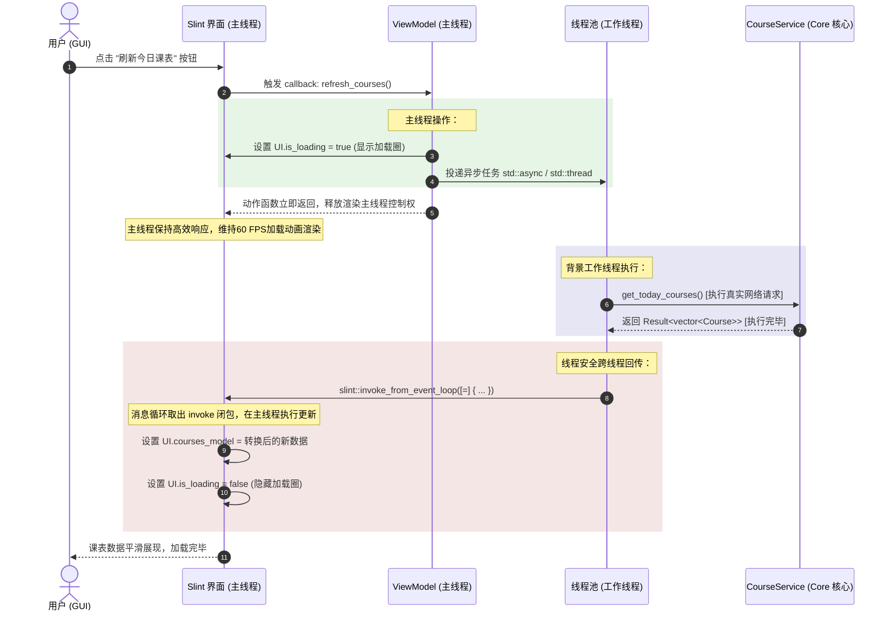

# Windows 桌面端 Slint GUI 架构设计 (v0.8 计划)

> 当前仓库版本阶段为 `v0.3.0`。Windows Slint GUI 属于路线图 `v0.8` 后续计划；本页是架构设计草案，不代表 v0.3 当前可运行入口。

本设计文档详细阐述了 Windows 桌面端基于 **Slint** 界面描述框架与 `UBAANextCore` 业务核心库的集成方案。核心目标是构建一个具备极致流畅度、响应迅速、线程安全的现代化图形用户界面，避免任何网络延迟或密集的 CPU 计算导致 UI 发生卡顿或未响应现象。

---

## 1. 经典 MVVM 架构布局

UBAA Next 桌面客户端的 GUI 开发严格遵循 **MVVM (Model-View-ViewModel)** 设计模式。这一模式能够将纯声明式的界面呈现（View）与纯 C++ 编写的底层业务逻辑（Model）以一种高内聚、低耦合的方式进行缝合。

```
┌────────────────────────────────────────────────────────────────────────────────────────┐
│                              Windows Slint 外壳应用                                    │
│                                                                                        │
│   ┌───────────────────────────┐                         ┌───────────────────────────┐  │
│   │        View (视图)        │                         │    ViewModel (视图模型)   │  │
│   │                           │    数据绑定 (Bindings)  │                           │  │
│   │   ui/MainWindow.slint     │ ◄─────────────────────► │     SlintViewModel.hpp    │  │
│   │                           │                         │                           │  │
│   │  定义布局、窗口状态、动画   │   回调函数 (Callbacks)  │  充当 UI 属性与 C++ 服务的  │  │
│   │  及交互事件（Button 点击） │ ──────────────────────► │  适配中转层，维护数据状态   │  │
│   └───────────────────────────┘                         └─────────────┬─────────────┘  │
└───────────────────────────────────────────────────────────────────────┼────────────────┘
                                                                        ▼
┌────────────────────────────────────────────────────────────────────────────────────────┐
│                               UBAANextCore 核心库 (Model)                             │
│                                                                                        │
│       ┌───────────────────────────┐                     ┌───────────────────────────┐  │
│       │        Service 层         │                     │        Storage 层         │  │
│       │  CourseService / Auth...  │ ◄─────────────────► │    ICacheStore 内存缓存   │  │
│       └───────────────────────────┘                     └───────────────────────────┘  │
└────────────────────────────────────────────────────────────────────────────────────────┘
```

### 1.1 View (视图层)
*   **开发技术**：纯声明式的 `.slint` 标记文件。
*   **主要职责**：定义整个桌面窗口的布局、配色方案（遵循现代和谐渐变与 Sleek 暗色模式）、微交互动画效果以及底层各层级的子组件（登录表单、课表网格、自习室列表等）。
*   **交互输出**：向 ViewModel 暴露 `in-out` 属性（如 `username`、`password` 输入框内容）与交互回调动作 `callback`（如 `login-clicked()`）。

### 1.2 ViewModel (视图模型层)
*   **开发技术**：C++ 适配封装类（由 Slint CMake 自动生成的 C++ 头文件配合手写状态绑定代码）。
*   **主要职责**：
    1.  **数据转换适配**：将 `UBAANextCore` 强类型的 C++ 结构体数据（如 `std::vector<Course>`）转换为 Slint 内置支持的弱类型集合属性（如 `std::shared_ptr<slint::Model<CourseItem>>`）。
    2.  **事件注册监听**：在 Slint UI 类实例上使用 `on_login_clicked`、`on_refresh_courses` 注册捕获 UI 点击事件，并在满足触发条件时，向背景线程派发底层服务请求。
    3.  **UI 状态维护**：维护全局的加载指示器状态（`is-loading`）、错误信息对话框显示等非持久化 UI 交互状态。

### 1.3 Model (模型/核心服务层)
*   **开发技术**：标准的跨平台 C++ 核心库 `UBAANextCore`。
*   **主要职责**：执行真实的协议解析、与校园网后端通信、读写加密的 Windows DPAPI 本地安全存储、以及管理短周期的局部数据缓存。

---

## 2. 非阻塞主循环设计 (Non-blocking Main Loop)

### 2.1 阻塞问题根源分析
Slint 应用程序的核心生命周期由渲染主线程中的主事件循环接管（即调用 `slint::run_event_loop()`）。该循环是一个**完全同步且阻塞**的管道，主要负责接收 OS 系统窗口消息、处理鼠标键盘事件以及执行 60 FPS 的硬件渲染。

如果 ViewModel 在捕捉到用户“刷新课表”的点击事件时，直接在主线程中同步调用了 `CourseService::get_today_courses()`，由于该服务需要发起真实的 HTTP/WebVPN 请求并解析 HTML 报文，主渲染线程将被迫阻塞数秒之久。在此期间，界面无法响应任何操作系统事件，系统窗口会呈现假死状态甚至显示“未响应”白屏。

### 2.2 多线程调度解耦设计 (Background Worker Threads)
为了实现零卡顿的流畅体验，UBAA Next GUI 引入了**单主线程渲染 + 背景工作线程池**的异步调度模型：

1.  **UI 动作发起**：主线程响应点击，首先将 UI 置为加载状态（例如将 Slint 里的 `is-loading` 属性设为 `true`，以展现微动画加载状态圈），抑制二次重复点击。
2.  **异步投递任务**：ViewModel 将耗时的工作（网络请求与数据解析）封装为一个异步 Lambda 闭包，投递给全局的 **C++ 背景工作线程池**（或拉起一个专用工作守护线程）。投递完成后，主线程立即退回 Slint 事件循环以维持 60 FPS 渲染。
3.  **背景服务执行**：背景工作线程在后台独立调用底层的 C++ Core 服务，这部分执行完全不会对 UI 产生任何交互干扰。
4.  **安全线程回传**：服务获取响应并生成 Result 后，工作线程绝对不允许直接跨线程修改 Slint 实例属性（Slint C++ 对象非线程安全）。必须使用 Slint 专门提供的 `slint::invoke_from_event_loop` 将数据更新的更新动作封包，回传给主线程队列执行更新。

---

## 3. 主渲染与背景工作线程交互时序

以下是执行一次典型的“拉取今日课程”异步交互的时序逻辑：



---

## 4. 线程安全数据回传核心集成代码

以下提供了在 C++ ViewModel 层进行非阻塞服务调用的核心实现范式。代码演示了如何完美缝合 `std::thread`、UBAANext 的服务工厂以及 `slint::invoke_from_event_loop` 线程桥：

```cpp
#include "MainWindow.h" // 由 Slint 自动生成的 C++ 头文件
#include <UBAANext/UBAANext.hpp>
#include <slint-cpp.h>
#include <thread>
#include <vector>
#include <memory>

class SlintViewModel {
public:
    explicit SlintViewModel(std::shared_ptr<MainWindow> ui_handle, UBAANextCli::ServiceFactory& service_factory)
        : m_ui(std::move(ui_handle)), m_factory(service_factory) 
    {
        // 1. 在 View 上绑定刷新课表的按钮点击事件回调
        m_ui->on_refresh_today_courses([this]() {
            dispatch_fetch_courses_task();
        });
    }

private:
    void dispatch_fetch_courses_task() {
        // 立即在主渲染线程置 UI 状态为 Loading，阻断用户二次重复点击
        m_ui->set_is_loading(true);
        m_ui->set_error_message("");

        // 2. 启动背景线程（或投递到系统工作线程池），避免阻塞当前主渲染循环
        std::thread([this]() {
            // 在背景线程中同步执行 Core 的耗时服务层网络调用
            auto course_service = m_factory.create_course_service();
            auto result = course_service.get_today_courses();

            // 3. 跨线程同步桥：必须在主线程上下文更新 Slint 实例属性
            slint::invoke_from_event_loop([this, res = std::move(result)]() {
                // 此 Lambda 保证在 Slint 渲染主线程内安全执行
                m_ui->set_is_loading(false);

                if (!res) {
                    // 处理业务失败（如会话超时或网络错误）
                    m_ui->set_error_message(res.error().message.c_str());
                    return;
                }

                // 4. 数据转换：将 C++ Core 强类型向量转换为 Slint 界面数据类型
                auto slint_model = std::make_shared<slint::VectorModel<CourseItem>>();
                for (const auto& course : *res) {
                    CourseItem ui_item;
                    ui_item.name = course.name.c_str();
                    ui_item.time = course.time_slot.c_str();
                    ui_item.classroom = course.classroom_name.c_str();
                    slint_model->push_back(ui_item);
                }

                // 刷新 UI 的数据源绑定属性，触发界面的自动局部重绘
                m_ui->set_courses_model(slint_model);
            });
        }).detach(); // 守护并分离线程，生命周期交由 OS 调度
    }

    std::shared_ptr<MainWindow> m_ui;
    UBAANextCli::ServiceFactory& m_factory;
};
```

通过本套高度精简、多线程安全的事件循环映射架构，Windows 桌面版本的 UBAA Next 客户端能够在不依靠庞大重量级 UI 框架的前提下，提供丝滑至极的动态流畅体验，实现零卡顿、高可用的优秀终端表现。
