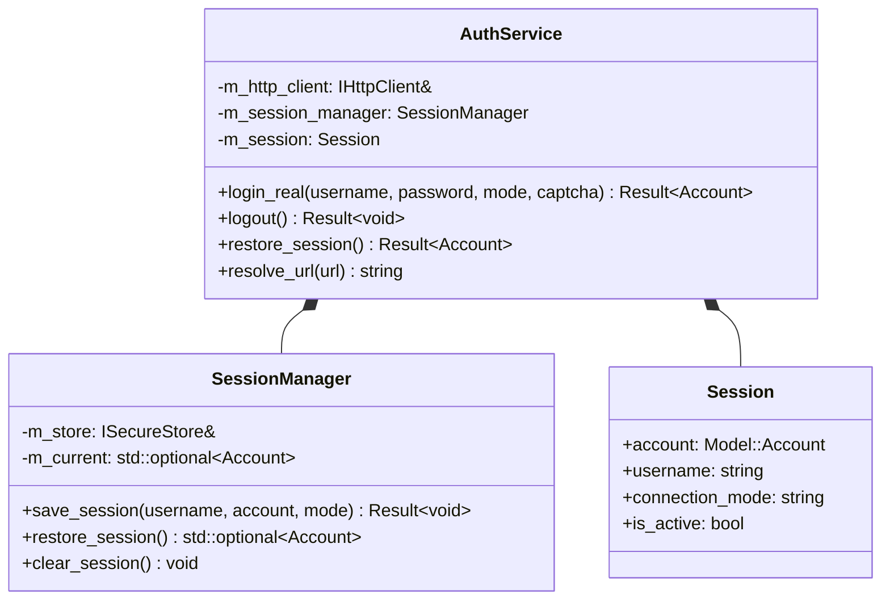

# 会话管理设计 (Session Design)

本篇文档详述 `UBAANext` 原生核心库在处理会话（Session）生命周期、凭据加载、下挂存储交互以及多网络连接模式分流时的具体系统架构设计。

## 1. 核心架构与职责分工

在核心库的 `UBAANext::Auth` 命名空间下，会话管理由三个核心类协同工作，建立起严密的安全边界：



### 1.1 各模块职责：
*   **`AuthService` (服务门面)**：作为认证服务的唯一对外面板。编排真实 SSO / WebVPN 网络握手请求，提取 CAS 表单的 `execution` 令牌，并根据响应状态码引导网络重定向（`follow_redirects`），解析子系统 Cookie 域。
*   **`SessionManager` (存储编排)**：专职负责内存会话状态缓存（`m_current`）与底层持久化键值对（`ISecureStore`）的生命周期编排。
*   **`Session` (数据模型)**：纯粹的内存会话数据镜像，保存当前活动用户的 `studentId`、`displayName` 及本会话绑定的路由模式。

---

## 2. SSO / WebVPN 登录流与状态流转

当客户端触发 `login_real` 登录动作时，`AuthService` 会根据所选的 `ConnectionMode` 驱动底层请求。

### 2.1 真实 WebVPN/SSO 网关跳转流程 (以 WebVPN 为例)：
1.  **首选访问**：请求统一认证 SSO 地址 `https://sso.buaa.edu.cn/login`。如果处于 `ConnectionMode::WebVPN`，`resolve_url` 会将其自动反解重定向为 WebVPN 网关代理的 URL（包含相应的 VPN Cookie 和主机签名）。
2.  **提取 Execution**：从返回的 HTML 错页/表单中检索并正则提取 CAS 登录的 `execution` 参数（此步骤绝不打印原始 HTML 以防令牌泄漏）。
3.  **构造表单**：将学号、密码、验证码（如有）、`execution` 与常规登录选项整合成 URL 编码的 `x-www-form-urlencoded` 表单，发送 `POST` 请求（见 `build_login_form`）。
4.  **跟随重定向**：禁用底层传输层的自动跳转，使用 `follow_redirects` 手动跟随服务器的 `302 Found` 响应（最多 10 次）。提取各下游子系统（如 `app.buaa.edu.cn`、教务处）下发的 `Set-Cookie` 并安全更新至 Cookie 罐中。
5.  **保存会话**：提取成功跳转后响应的主体信息（包含显示姓名），生成 `Model::Account` 强类型模型，调用 `SessionManager::save_session` 进行本地保存。

---

## 3. 连接模式路由切换机制

```cpp
enum class ConnectionMode {
#if UBAANEXT_ENABLE_MOCKS
    Mock,       ///< 调试桩模式
#endif
    Direct,     ///< 真实内网直连（校园网或直接 VPN）
    WebVPN,     ///< WebVPN 代理模式
};
```

*   **URL 反解 (resolve_url)**：
    *   在直连模式下，所有服务请求 URL 保持原址发送（如 `http://iclass.buaa.edu.cn/`）。
    *   在 WebVPN 模式下，底层 `AuthService::resolve_url` 会调用内置的 `VpnCipher`，将原始 URL 转译为 WebVPN 的专用代理 URL。这对上层业务代码（如课表拉取、考试拉取等）是**完全透明**的。
*   **物理分桶**：
    *   在 C ABI 层，为防止 Direct 模式与 WebVPN 模式串用 Cookie 或 VPN Header 导致学校网关检测到异常而踢出 Session，两种模式在 Context 中属于完全隔离的独立运行时 Bucket 实例，从物理源头上断绝了 Cookie 串用的风险。
