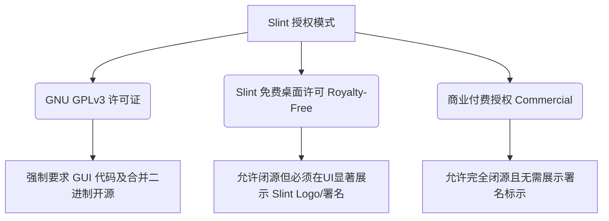

# Slint GUI 许可规范与集成策略 (v0.8 计划)

> 当前仓库版本阶段为 `v0.4.0`。Slint GUI 属于路线图 `v0.8 — Windows Slint GUI` 后续计划，本页是未来引入 Slint 时的许可与合规说明，不代表 v0.4 当前已交付 GUI。

本文档解析 UBAA Next 项目在未来引入 **Slint** 作为原生 Windows GUI（图形界面）框架时的双重/多重许可机制（GPLv3 / 商业许可 / Royalty-Free 免费桌面许可），并规划在保障核心库 MIT 许可纯净性的前提下，实现 GUI 外壳集成的法律与技术策略。

---

## 1. Slint 许可机制深度解析

Slint（前身为 SixtyFPS）是一款采用 Rust 编写、原生支持 C++ 绑定的声明式现代化 UI 框架。正式引入前必须以实际选定版本的官方许可文本为准；本文按当前规划关注以下三种常见授权模式：



### 1.1 GNU GPLv3 授权（传染性开源）
* **核心定义**：如果选择 GPLv3 协议，开发者可以免费且无限制地修改、编译和分发 Slint 及其衍生作品。
* **传染约束**：GPLv3 具有强烈的 Copyleft 传染属性。这意味着如果 UBAA Next 的 Windows GUI 应用直接编译链接了 GPLv3 模式下的 Slint，那么**整个 GUI 应用程序（包括 UI 定义文件、ViewModel 逻辑及胶水层代码）在分发时必须全面以 GPLv3 协议向社会公开源码**。
* **核心兼容性**：由于 UBAA Next 核心库采用的是 MIT 协议，而 MIT 协议是 GPLv3 的兼容子集，因此允许将 MIT 核心代码动态或静态地链入 GPLv3 的 GUI 二进制文件中。在此组合下，最终分发给用户的 GUI 完整可执行文件（如 `ubaa-gui.exe`）将整体受 GPLv3 约束，但核心库（Core）在独立分发时依旧保留 MIT 许可。

### 1.2 Slint 免费桌面/嵌入式许可（Royalty-Free Desktop License）
* **核心定义**：为了支持独立开发者与中小企业，Slint 提供了一种免费的专有许可。在开发**桌面端应用**或符合限制的嵌入式应用时，允许闭源分发。
* **核心约束**：使用该免费版许可，开发者**必须在应用程序的用户界面（通常为“关于/About”窗口）中显著展示 Slint 官方指定的 Logo/署名，并链接到 Slint 官网**。
* **适用性**：如果 UBAA Next 团队或未来的二次开发团队希望在保护 UI 专属产权的同时避免付费，可以申请或采用此授权，并在界面上规范保留 "Powered by Slint" 标示。

### 1.3 商业付费授权（Commercial License）
* **核心定义**：对于需要完全移除 Slint 署名、将 UI 闭源且不接受 GPLv3 约束的商业定制实体，可以通过购买 Slint 的商业专有授权来获得豁免。在校园聚合服务客户端的定位下，一般无需选用此商业授权，除非后续有特定的商业外包或专有软硬件一体化设备需求。

---

## 2. UBAA Next 核心库与 GUI 外壳的安全隔离设计

为了在引入 Slint 的同时，绝对不污染 UBAA Next 核心库（`UBAANextCore`）的宽松 MIT 许可，项目架构必须在技术上实现**“物理隔离”**与**“依赖闭环”**：

### 2.1 依赖架构红线
1. **Core 绝对不导入 Slint 依赖**：
   在 `CMakeLists.txt` 中，`core` 目录及其所有子模块（网络、协议、安全存储、解密）的 C++ 代码中，绝对禁止包含任何 `slint.h` 或引入 Slint 相关 target。
2. **C ABI 胶水层单向链接**：
   Slint GUI 作为一个独立的外部目标（Target：`ubaa-gui`），仅单向链接 `UBAANextCore` 库或调用 `UBAANextBindingsC` 的 C ABI 接口。
3. **分立的 CMake 配置**：
   在 `CMakeLists.txt` 中，`UBAANEXT_BUILD_GUI` 选项默认关闭。仅在开发桌面 GUI 时显式启用。Slint 的查找与构建逻辑仅限制在 `apps/windows-slint-gui` 目录下。

### 2.2 隔离拓扑结构图

```
┌────────────────────────────────────────────────────────┐
│               UBAA Next Core (MIT 授权)                 │
│  - 校园协议解析                                        │
│  - 数据脱敏、安全存储、写入网关                        │
└───────────────────────────┬────────────────────────────┘
                            │ (通过 C ABI / ViewModel 单向调用)
                            ▼
┌────────────────────────────────────────────────────────┐
│          Windows Slint GUI App (GPLv3 / 免费桌面许可)    │
│  - Slint UI Markup (.slint 文件)                        │
│  - 桌面端 ViewModel 及事件处理                          │
│  - 署名展示 (Powered by Slint)                           │
└────────────────────────────────────────────────────────┘
```

---

## 3. 集成合规操作指南

在版本演进至 v0.8 并正式交付 Slint 桌面图形客户端时，发布团队必须无条件履行以下合规步骤：

### 3.1 若选择 GPLv3 模式发布 GUI
1. **源码声明**：在 `apps/windows-slint-gui/` 目录下添加 `LICENSE.GPLv3` 文件，并在所有 GUI 源码文件头部声明受 GPLv3 约束。
2. **分发附带**：在打包分发 `ubaa-gui.exe` 时，发布压缩包中必须包含 GPLv3 的完整许可文本。
3. **开源履约**：必须在 GitHub 仓库中完整公开构建 GUI 所需的全部 `.slint` 声明式 UI 代码及 C++ 胶水代码，不得有任何扣留。

### 3.2 若选择 Royalty-Free 免费桌面模式发布 GUI
1. **署名规范**：在 GUI 主窗口的“关于”页面或明显位置，使用 Slint 官方 SVG 素材渲染 **"Powered by Slint"** 标志。
2. **超链接指向**：该署名标志或文字必须支持鼠标悬停和点击，点击后通过系统默认浏览器跳转至 Slint 官方网站 (`https://slint.dev`)。
3. **合规审计**：在发布审核前，必须截图保留 UI 署名展示状态，并归档于 `docs/licensing/compliance/` 目录中。

---

通过严格的“MIT Core + 专有/GPL GUI”边界设计，UBAA Next 成功规避了开源版权纠纷风险，在保持底层业务代码最大化灵活性的同时，也为未来桌面客户端的演进奠定了合规、稳健的法律基石。
