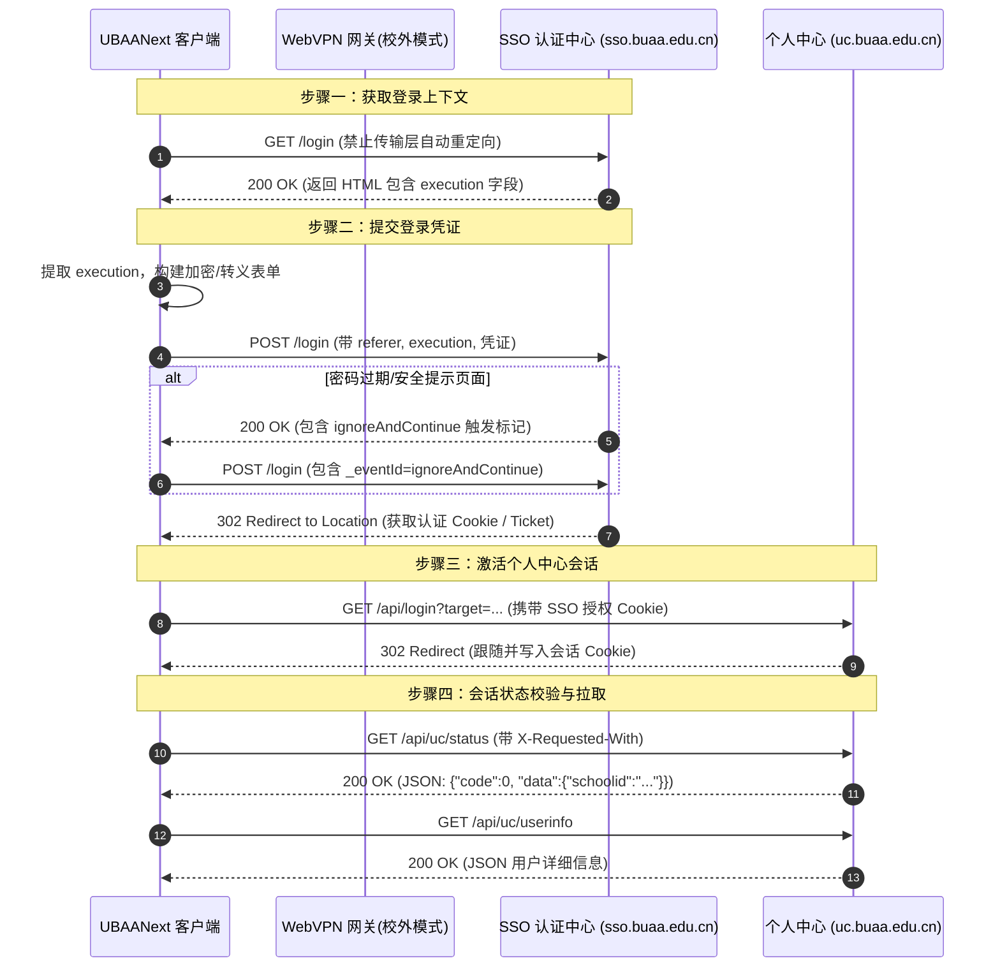
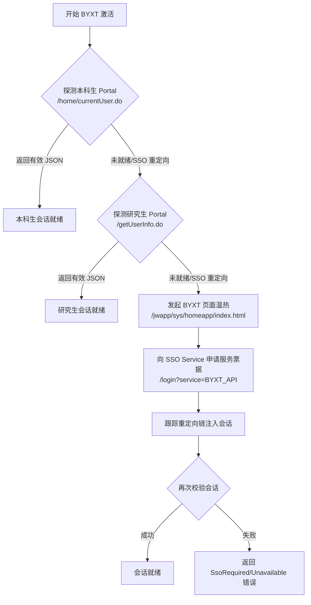

# UBAANext 统一身份认证与会话激活协议设计方案

本文档详细描述了 UBAANext 客户端系统的统一身份认证（CAS SSO）、底层会话激活（Session Activation）、VPN 流量路由、下游业务系统（如 BYXT、iClass 签到系统）会话建立与状态维护的协议交互与执行捕获机制。

---

## 1. 概述与网络连接模式

UBAANext 是一个去中心化的高性能桌面客户端，其所有网络通信均直接发生在客户端与学校服务器之间。系统提供了三种网络连接模式以适应不同的网络拓扑结构：

1. **Direct（直连模式）**：适用于校园网内网环境，直接向 `*.buaa.edu.cn` 的物理服务器发起 HTTPS 请求。
2. **WebVPN 模式（WebVPN 网关路由）**：适用于校外环境。所有非 `https://d.buaa.edu.cn/` 前缀的请求 URL，均通过客户端内置的 `VpnCipher::to_vpn_url` 加密算法，转换为 WebVPN 路由的路径。
3. **Mock 模式**：仅用于本地合同测试与离线业务验证，不发起真实远端网络交互。

### 1.1 WebVPN 动态 URL 转换规则
在 WebVPN 模式下，底层 `HttpClient` 发起的所有业务请求及认证重定向地址都会通过服务层调用 `AuthService::resolve_url` 进行转换：
- 原始 URL: `https://sso.buaa.edu.cn/login`
- WebVPN 转换后: `https://d.buaa.edu.cn/https/7777772e73736f2e627561612e6564752e636e/login`（具体由 `VpnCipher` 编解码器处理）
- 如果 URL 已经以 `https://d.buaa.edu.cn/` 开头，则保持原样，避免重复编码。

---

## 2. 统一身份认证（CAS SSO）深度交互流程

UBAANext 的统一身份认证核心位于 [AuthService.cpp](file:///d:/Code/Cpp/UBAANext/core/src/Auth/AuthService.cpp) 的 `login_real` 方法中。整个 CAS 认证是一个多步骤的 HTML 提取、表单构建和安全的重定向追踪过程。

### 2.1 详细交互步骤

#### 2.1.1 步骤一：获取 CAS 登录页与上下文
客户端向 CAS 发起第一步 GET 请求：
- **请求方法**：`GET`
- **URL**：`https://sso.buaa.edu.cn/login` （若为 WebVPN 模式则解析为 VPN 地址）
- **安全请求头**：
  - `Accept`: `text/html,application/xhtml+xml,*/*`
  - `User-Agent`: `UBAANext/0.4`
- **重定向控制**：显式调用 `disable_transport_redirects(request)`，将底层传输组件的自动重定向追踪关闭，以利于应用层细粒度捕获中间状态。

#### 2.1.2 步骤二：提取 Execution 凭证与错误诊断
解析步骤一返回的 HTML 内容，提取登录流程上下文令牌 `execution`：
- **提取原理**：使用 `Protocol::extract_execution(html)` 解析 HTML 中形如 `<input type="hidden" name="execution" value="[token_value]"/>` 的节点。
- **异常保护**：若未找到 `execution` 且响应状态码为 302，说明当前传输链已带登录态，直接跳至**步骤五（激活 UC）**；若状态码为 200 且未找到 `execution`，则判定为解析失败，稳定返回 `ErrorCode::ParseError`。

同时，在任何非预期的 200 响应中，调用 `detect_error(html)` 进行基于正则表达式的错误消息分类与风控限制检查：
- 识别 HTML 中的错误节点，如 `tip-text`、`errors` 或 `id="errorDiv"`。
- 提取提示文本并剥离 HTML 标签（如“用户名或密码错误”、“验证码不正确”）。
- 对包含“验证码”、“频繁”、“限制”、“安全风险”、“locked”等指征的页面，降级为友好的风控拦截中文消息提示。

#### 2.1.3 步骤三：防风险/密码过期自动绕过（忽略并继续机制）
在学校 CAS 系统中，可能会遇到密码过期警告或账号安全风险提示页面。系统内置了自动绕过（Password Expiry Bypass）逻辑：
- **条件判定**：`is_ignorable_password_expiry_page(html)` 检查页面是否包含 `continueForm`、`ignoreAndContinue`、`账号存在安全风险`、`密码过期`，且同时包含 `execution` 变量。
- **自动绕过表单**：
  - 构建 POST 负载：`execution=[execution]&_eventId=ignoreAndContinue`
  - 向当前重定向到的 URL 发起 POST 请求，请求头同样带上 `Content-Type: application/x-www-form-urlencoded`。
  - 继续处理返回的重定向响应。

#### 2.1.4 步骤四：表单构建与登录 POST 提交
客户端整合用户凭证，调用 `build_login_form` 构建登录 Payload：
- **编码与防泄漏**：输入参数（username, password, captcha）经过 `Protocol::form_url_encode` 转义处理。
- **Payload 边界**：
  `username=[encoded_username]&password=[encoded_password]&execution=[execution]&_eventId=submit&geolocation=&submit=`
  若提供了验证码，则追加 `&captchaResponse=[encoded_captcha]`。
- **Referer 绑定保护**：请求头必须设置 `Referer: https://sso.buaa.edu.cn/login`（或 WebVPN URL），防止跨站请求伪造防御机制（CSRF）拒绝响应。

#### 2.1.5 步骤五：安全的重定向链追踪 (Redirect Follow Chain)
客户端实现应用层重定向追踪函数 `follow_redirects`：
- **深度限制**：最大重定向次数限制为 10 次，防止无限循环。
- **重定向地址过滤**：为了防范凭证窃取（Phishing）和开放重定向漏洞，每次重定向的 `Location` 地址必须通过 `is_allowed_redirect_url` 进行主机域校验：
  - URL 必须以 `https://` 开头。
  - 重定向主机域必须精确等于 `buaa.edu.cn`，或者其后缀为 `.buaa.edu.cn`（如 `sso.buaa.edu.cn`, `uc.buaa.edu.cn`）。
  - 若不符合，稳定返回 `ErrorCode::NetworkError`，并附带错误消息“拒绝不安全的重定向地址”。

---

## 3. 个人中心会话激活（UC Activation）与校验

登录成功后，需要激活统一数据平台（个人中心 UC）以确认会话的生命周期。

### 3.1 步骤六：激活个人中心
客户端请求 UC 的激活 API，将登录后的授权凭证注入到 UC 系统中：
- **GET 请求 URL**：`https://uc.buaa.edu.cn/api/login?target=https%3A%2F%2Fuc.buaa.edu.cn%2F%23%2Fuser%2Flogin`
- **重定向处理**：同样通过应用层 `follow_redirects` 追踪 302 链，直至返回状态码 200。

### 3.2 步骤七：会话状态验证与身份拉取
获取到 UC 会话后，向状态接口发起 AJAX 请求进行校验：
- **请求 URL**：`https://uc.buaa.edu.cn/api/uc/status`
- **安全请求头（必须）**：
  - `Accept`: `application/json, text/javascript, */*; q=0.01`
  - `X-Requested-With`: `XMLHttpRequest`
- **会话状态判定**：
  - 响应的 HTTP 状态码必须是 200。
  - 解析 JSON 响应体。JSON 根节点必须包含 `"code": 0`。
  - 字段提取：从根节点或 `data` 子对象中提取 `schoolid`（或 `username`）作为账户的学生学号，提取 `name`（或 `realName`）作为展示姓名。
- **深度拉取**：调用 `https://uc.buaa.edu.cn/api/uc/userinfo` 接口，拉取更加完整的个人数据，以防止 `status` 返回的姓名为空。

---

## 4. 下游业务系统（BYXT/iClass）会话建立与执行

在统一 SSO 认证成功后，下游各个子业务系统需要使用自己独立的子会话协议。

### 4.1 本科生/研究生综合业务系统（BYXT）会话激活
BYXT 系统的会话激活定义在 [ByxtSession.cpp](file:///d:/Code/Cpp/UBAANext/core/src/Protocol/ByxtSession.cpp) 中。

#### 4.1.1 探测机制（Portal Probe）
系统提供敏捷的双路径自动探测：
- **本科生探测**：访问 `https://byxt.buaa.edu.cn/jwapp/sys/homeapp/api/home/currentUser.do`，带上 Ajax 头。若返回非 HTML 的标准 JSON，则归类为 `UndergradReady`。
- **研究生探测**：访问 `https://gsmis.buaa.edu.cn/gsapp/sys/yjsemaphome/modules/pubWork/getUserInfo.do`。若返回 JSON 且包含 `"code":"0"` 以及 `"userId"` 或 `"userName"`，则归类为 `GraduateReady`。

#### 4.1.2 激活链路与票据注入
若探测发现会话失效，则向 SSO 申请该业务系统的服务票据（Service Ticket）：
- **请求地址**：`https://sso.buaa.edu.cn/login?service=https%3A%2F%2Fbyxt.buaa.edu.cn%2Fjwapp%2Fsys%2Fhomeapp%2Fapi%2Fhome%2FcurrentUser.do`
- **自动温热与重定向**：访问温热页 `https://byxt.buaa.edu.cn/jwapp/sys/homeapp/index.html`。执行 `follow_redirect_chain` 追踪 302 重定向链。在此链中，CAS 服务器会将 Ticket 附加在 URL 参数中回调 BYXT 接收端，BYXT 验证 Ticket 后在 HTTP 头部写入会话 Cookie，实现透明的子系统会话激活。

---

### 4.2 iClass 签到系统会话建立与签到捕获
iClass 签到系统是一个独立的移动端签到服务，其认证和执行流程定义在 [SigninService.cpp](file:///d:/Code/Cpp/UBAANext/core/src/Service/SigninService.cpp) 中。

#### 4.2.1 步骤一：解析签到专属登录名（LoginName Resolution）
iClass 系统并不直接以学号作为直接的手机号认证键，需要解析专属的 `loginname`：
- **重定向跳转起点**：向 `https://iclass.buaa.edu.cn:8346/?type=jumpMyCenter` 发起 GET 请求，并限制系统传输自动重定向。
- **链条追踪**：追踪至多 8 次重定向。在重定向的 `Location` 或跳转 URL 中，使用正则表达式或字符串搜索提取 `loginname=[value]`。若成功提取，则进行 URL 解码作为认证名称；若所有重定向链追踪完毕未提取成功，则退化使用当前登录用户的 `student_id`。

#### 4.2.2 步骤二：登录签到中心获取会话令牌
使用解析得到的登录名，模拟移动端获取会话 ID：
- **请求接口**：
  `https://iclass.buaa.edu.cn:8347/app/user/login.action?password=&phone=[login_name]&userLevel=1&verificationType=2&verificationUrl=`
- **数据结构与会话边界**：
  响应返回 JSON 结构体。若登录成功，返回的 `result` 对象中必须包含 `id` (用户唯一标识) 和 `sessionId` (会话令牌)。
- **会话持久化**：
  将获取到的 `id` 和 `sessionId` 缓存在内存变量中，供后续拉取和签到使用。

#### 4.2.3 步骤三：获取今日签到日程
- **请求接口**：
  `https://iclass.buaa.edu.cn:8347/app/course/get_stu_course_sched.action?id=[user_id]&dateStr=[YYYYMMDD]`
- **认证验证头**：
  必须在 HTTP Headers 中包含自定义头：`sessionId: [session_id]`。
- **自动恢复机制**：
  若返回的响应指示 `STATUS` 异常（说明 `sessionId` 已经失效），系统将自动触发 `ensure_iclass_session(true)` 强制重新进行上述的登录流程，并重试拉取。

#### 4.2.4 步骤四：执行签到与时间同步机制
执行签到操作不仅需要会话 ID，还需要防重放的服务器时间戳：
- **时间同步**：
  首先向 `http://iclass.buaa.edu.cn:8081/app/common/get_timestamp.action` 发起 GET 请求，提取服务器端的精准 UNIX 时间戳。
- **签到提交**：
  - **请求方法**：`POST`
  - **请求 URL**：
    `http://iclass.buaa.edu.cn:8081/app/course/stu_scan_sign.action?courseSchedId=[course_id]&timestamp=[timestamp]`
  - **Headers**：
    - `sessionId`: `[session_id]`
    - `Content-Type`: `application/x-www-form-urlencoded`
  - **POST 负载**：
    `id=[user_id]` （进行 URL 编码）
  - **结果验证**：
    校验返回 JSON 中 `result` 内的 `stuSignStatus` 是否为 `"1"` 或 `"success"`。若不为 1，则根据返回的 `ERRMSG` 判定原因（例如“已签到”、“未开始”、“不在范围”、“已结束”），进行中文语义转化并反馈给用户。
