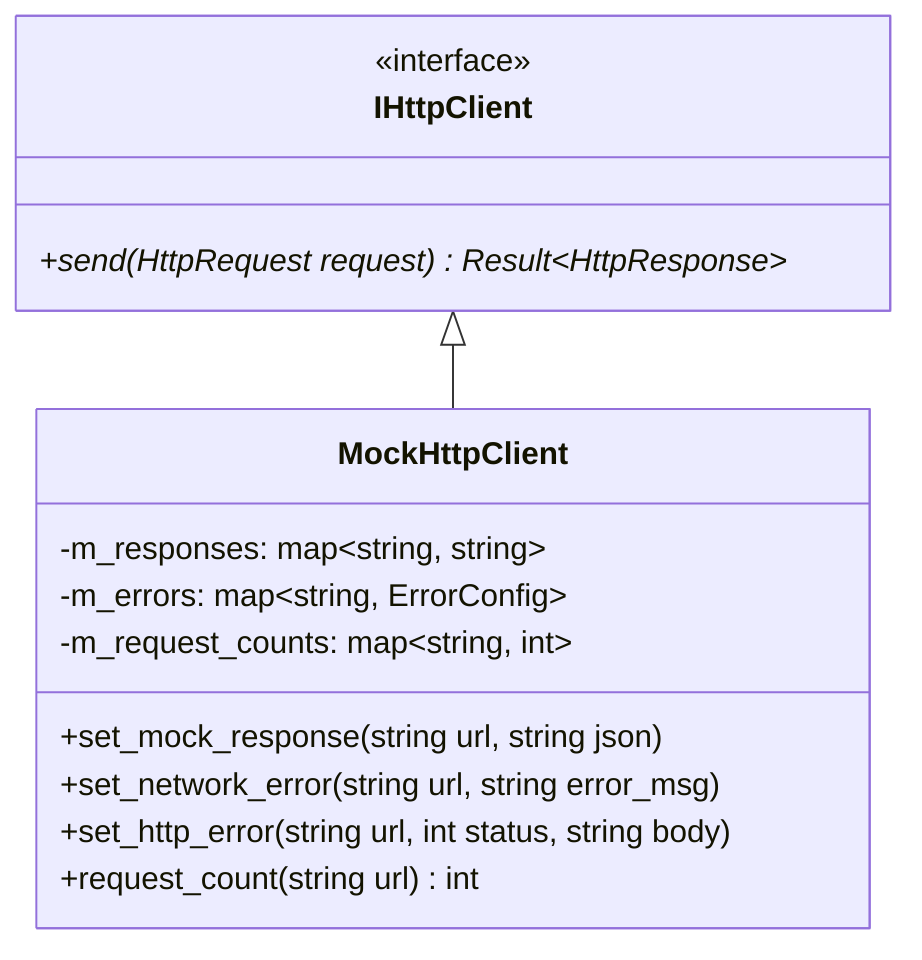

# UBAANext Mock 离线协议与客户端模拟规范

在高等教育信息化系统重构中，由于内网环境限制和真实系统的高敏感性，离线模拟测试和合同驱动开发（Contract-Driven Development）是保证系统可靠性的关键。本文档规定了 UBAANext 中 Mock 协议的设计规范、Mock 客户端的内部实现原理、预设的数据载荷边界，以及如何在集成测试中配置动态异常路由。

---

## 1. 编译开关与模拟模式激活

UBAANext 通过 C++ 预处理器宏控制 Mock 代码的编译和运行期展现：

* **编译宏定义**：`UBAANEXT_ENABLE_MOCKS`
  若在 CMake 配置中开启了该宏，C++ 编译器将包含 mock 模块的相关定义，并在底层以及 API 接口层暴露出以下特性。
* **连接模式（ConnectionMode::Mock）**：
  在 `AuthService.hpp` 中定义了连接模式枚举，当启用 Mock 编译时，包含 `ConnectionMode::Mock` 成员。
* **Mock 登录入口**：
  `AuthService::login_mock(username, password)` 仅在 `UBAANEXT_ENABLE_MOCKS` 被激活时编译可用。此方法不发起任何真实的 CAS 网络调用，只验证用户名和密码是否为空：
  * 若用户名或密码为空，稳定返回 `ErrorCode::InvalidArgument` 错误。
  * 验证通过后，将直接调用本地 `SessionManager::save_session`，在安全存储中保存测试账号 `Test User`，并建立本地的有效会话上下文。

---

## 2. 基于 URL 路由的模拟客户端（MockHttpClient）

在测试套件中，通过注入继承自 `IHttpClient` 的 `MockHttpClient` 实现类（位于 [MockHttpClient.cpp](file:///d:/Code/Cpp/UBAANext/mocks/src/MockHttpClient.cpp)），来拦截和模拟所有的网络层请求。

### 2.1 匹配与路由机制
`MockHttpClient` 维护了一个路由表 `std::map<std::string, std::string> m_responses`。当调用 `send(const HttpRequest& request)` 方法时：
1. **请求计数**：首先增加当前请求 URL 对应的调用计数器 `m_request_counts[request.url]`。
2. **错误规则匹配**：优先检索错误配置映射表 `m_errors`，判断该 URL 是否被配置了模拟故障（参见下文第 4 节）。
3. **精准路径匹配**：在内部 `m_responses` 中按 `request.url` 进行精准键查找。
4. **稳定降级边界**：若路由表中**未配置**该 URL，则默认回退返回 HTTP 200 OK 状态码，且响应体（body）稳定为最小化空 JSON 结构体 `"{}"`。

---

## 3. 预设 Mock 数据规范（Payload Boundaries）

系统在 [MockHttpClient.cpp](file:///d:/Code/Cpp/UBAANext/mocks/src/MockHttpClient.cpp) 中预置了五个符合学校教务接口物理格式的标准 Mock 数据集，构成了离线测试的基准载荷边界。

### 3.1 今日/本周日程数据 (`/schedule/today`, `/schedule/week`)
* **关联静态 JSON**：`kCoursesJson`
* **载荷内容**：包含 3 门典型课程的完整 JSON 数组。
* **JSON 数据格式**：
```json
[
  {
    "id": "COURSE001",
    "name": "高等数学",
    "teacher": "张教授",
    "classroom": "J3-101",
    "weekStart": 1,
    "weekEnd": 16,
    "dayOfWeek": 1,
    "sectionStart": 1,
    "sectionEnd": 2,
    "courseCode": "MATH101",
    "credit": "3.0",
    "beginTime": "08:00",
    "endTime": "09:40"
  },
  {
    "id": "COURSE002",
    "name": "程序设计基础",
    "teacher": "李教授",
    "classroom": "J3-202",
    "weekStart": 1,
    "weekEnd": 16,
    "dayOfWeek": 1,
    "sectionStart": 3,
    "sectionEnd": 4,
    "courseCode": "CS101",
    "credit": "2.0",
    "beginTime": "10:00",
    "endTime": "11:40"
  },
  {
    "id": "COURSE003",
    "name": "大学物理",
    "teacher": "王教授",
    "classroom": "J3-303",
    "weekStart": 1,
    "weekEnd": 16,
    "dayOfWeek": 1,
    "sectionStart": 5,
    "sectionEnd": 6,
    "courseCode": "PHYS101",
    "credit": "3.0",
    "beginTime": "14:00",
    "endTime": "15:40"
  }
]
```

### 3.2 考试日程数据 (`/exam/list`)
* **关联静态 JSON**：`kExamsJson`
* **载荷内容**：包含 3 个典型考试科目的数组。
* **JSON 数据格式**：
```json
[
  {
    "id": "EXAM001",
    "courseName": "高等数学",
    "location": "J3-101",
    "timeText": "2026-06-20 09:00-11:00",
    "courseNo": "MATH101",
    "examDate": "2026-06-20",
    "startTime": "09:00",
    "endTime": "11:00",
    "seatNo": "15",
    "examType": "期末考试",
    "status": 1
  },
  {
    "id": "EXAM002",
    "courseName": "程序设计基础",
    "location": "J3-202",
    "timeText": "2026-06-22 14:00-16:00",
    "courseNo": "CS101",
    "examDate": "2026-06-22",
    "startTime": "14:00",
    "endTime": "16:00",
    "seatNo": "23",
    "examType": "期末考试",
    "status": 1
  },
  {
    "id": "EXAM003",
    "courseName": "大学物理",
    "location": "J3-303",
    "timeText": "2026-06-24 09:00-11:00",
    "courseNo": "PHYS101",
    "examDate": "2026-06-24",
    "startTime": "09:00",
    "endTime": "11:00",
    "seatNo": "8",
    "examType": "期末考试",
    "status": 1
  }
]
```

### 3.3 空闲教室可用性数据 (`/classroom/query`)
* **关联静态 JSON**：`kClassroomsJson`
* **载荷内容**：结构化教室可用性状态。
* **JSON 数据格式**：
```json
{
  "buildings": {
    "J3": [
      {"id": "J3-101", "name": "J3-101", "floorId": "1", "freeSections": [1, 2, 3, 4]},
      {"id": "J3-202", "name": "J3-202", "floorId": "2", "freeSections": [5, 6, 7, 8]},
      {"id": "J3-303", "name": "J3-303", "floorId": "3", "freeSections": [9, 10, 11, 12]}
    ]
  }
}
```

### 3.4 学期与教学周数据 (`/schedule/terms`, `/schedule/weeks`)
* **学期载荷**（`kTermsJson`）：包含 2 个学期对象，其中“2025-2026学年第二学期”的 `selected` 为 `true`。
* **教学周载荷**（`kWeeksJson`）：包含 20 周的数据，标记有各周的起始、结束日期，其中第 8 周标记为当前周 `isCurrent: true`。

---

## 4. 动态故障注入与行为控制（Runtime Mock API）

为了对网络超时、网关崩溃、授权失效和各种 HTTP 错误状态码进行完整的单元和集成测试，`MockHttpClient` 提供了运行期 Mock 控制接口。



### 4.1 动态覆盖响应载荷
通过调用：
```cpp
void set_mock_response(const std::string &url_pattern, std::string json_body);
```
测试用例可以传入自定义的 JSON 体。该方法调用后会**同时清除**为该 URL 配置的任何运行期故障策略。

### 4.2 模拟物理网络故障（Timeout / Connection Refused）
通过调用：
```cpp
void set_network_error(const std::string &url_pattern, std::string error_msg);
```
使得在请求匹配的 `url_pattern` 时，`send` 接口不返回 HTTP 状态码，而是直接返回带有 `ErrorCode::NetworkError` 和自定义错误信息的 `Result` 错误包装。

### 4.3 模拟非 200 HTTP 状态错误（401, 403, 500）
通过调用：
```cpp
void set_http_error(const std::string &url_pattern, int status_code, std::string body);
```
允许向被测业务组件提供高保真的 HTTP 层非正常返回。例如，注入 HTTP 401 携带“Unauthorized”包体，即可用于测试业务服务层的 SSO 自动重刷会话流程。

### 4.4 请求调用次数断言
`MockHttpClient` 通过：
```cpp
int request_count(const std::string &url_pattern) const;
```
暴露特定路由的调用次数。测试套件可通过此方法断言缓存机制是否生效（即验证重复调用特定 API 时，底层物理请求次数是否保持不变或符合预期）。

---

## 5. 离线测试集成路径与 Golden Files 关联

系统的集成测试与单元测试套件全部基于 [Catch2](https://github.com/catchorg/Catch2) 测试框架构建。

### 5.1 夹具（Fixtures）目录拓扑
系统在 `tests/fixtures/` 中为各个下游微模块建立了固定的 Golden 样本结构：
* `tests/fixtures/bykc/` (博雅课程个人资料、可选及已选课程、解析统计)
* `tests/fixtures/evaluation/` (评教系统问卷与提交样本)
* `tests/fixtures/judge/` (作业评测系统的提交详情与状态)
* `tests/fixtures/library/` (图书馆座位平面及预约数据)
* `tests/fixtures/signin/` (iclass 今日签到日程数据)
* `tests/fixtures/spoc/` (SPOC 教学平台的作业和资料)
* `tests/fixtures/venue/` (场馆预约系统平面)
* `tests/fixtures/ygdk/` (阳光打卡打卡记录及剩余次数)

### 5.2 离线测试的读取与执行机制
单元测试（例如 [BykcParserTests.cpp](file:///d:/Code/Cpp/UBAANext/tests/unit/BykcParserTests.cpp)）通过辅助宏和方法实现 Golden Files 的免网络离线灌入：
1. **加载物理夹具**：使用 `load_fixture(relative_path)` 自动计算 `UBAA_TEST_FIXTURES_DIR` 宏下的文件全路径并读取为内存字符串。
2. **校验文件读取正确性**：通过 `REQUIRE(input.good())` 断言夹具完好。
3. **输入 JSON 解析器**：调用 `load_json_fixture` 通过 `nlohmann::json::parse` 载入 JSON 树并确保未被 discard。
4. **解耦被测解析方法**：将反序列化后的 JSON 树传入具体的 `Parser` 类（如 `parse_bykc_courses`），最后通过 Catch2 的 `CHECK` 和 `REQUIRE` 进行字段内容和降级形态的完整校验。
