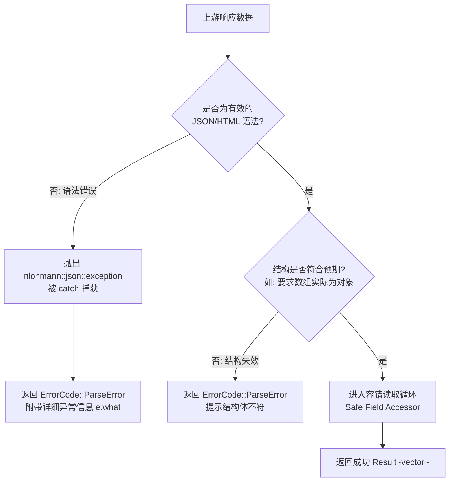

# UBAANext 解析器变更与数据漂移应对策略

在去中心化的高校信息化客户端开发中，上游教务、博雅、签到、评教系统由不同的集成商开发且处于频繁且不透明的滚动更新中。上游接口的字段变更、数据格式漂移（Data Drift）是导致客户端崩溃、解析失效的首要原因。

本文档规定了 UBAANext 解析器模块的设计哲学、容错数据漂移的实现规范、解析器错误分类以及基准 Golden Files 测试策略。

---

## 1. 容错解析设计与数据漂移处理策略

所有解析器实现类（如 [JsonParser.cpp](file:///d:/Code/Cpp/UBAANext/core/src/Parser/JsonParser.cpp) 和各个子业务解析器）必须遵循**“宽进严出”**的健壮性原则，不允许使用直接的 JSON 键值强制映射（如 `json["key"].get<T>()`），避免由于键缺失或类型不匹配引发运行时异常。

### 1.1 使用 Safe Field Accessor（`value()` 容错读取）
系统强制使用 nlohmann/json 提供的带有备选默认值的 `value()` 接口：
```cpp
// 推荐做法
c.id        = item.value("id", "");
c.week_start = item.value("weekStart", 0);
```
* **防 Key 缺失**：当上游删除了某个可选字段（如 `weekStart`），`value()` 将静默返回预设的默认值（如 `0`），保证后续行解析的连续性。
* **防 Null 字段值**：若服务器返回 `"classroom": null`，`value()` 亦会自动安全降级为空字符串 `""`，防止直接访问引起的类型解包失败。

### 1.2 数据类型漂移处理（Type Drift Resilience）
当上游接口字段类型发生变更（如 `id` 由 String 变成 Integer，或 `name` 变成了 Array/Object）时，解析层必须在过滤和规整后再写入 `Model`：
* **数值向字符串转换**：若上游 ID 字段类型发生混合，解析层应对数字类型进行安全的字符串化（Stringify），如 `BykcParser` 中将整数 `42` 兼容解析为 `"42"`。
* **异常复杂结构过滤**：若基础类型字段被替换为嵌套的 JSON 对象（如 `"courseName": {"zh": "数学", "en": "Math"}`），解析器必须识别出此类型不匹配并做丢弃或提取首选健壮子项的处理，而不是任其向 Model 层传递。
* **以 BykcParser 应对漂移为例**：
  在 [BykcParserTests.cpp](file:///d:/Code/Cpp/UBAANext/tests/unit/BykcParserTests.cpp) 的测试用例中，针对字段漂移设计了完备的异常数据应对模型：
  * 输入 `{"id": nullptr, "courseName": "缺少 id"}` —— 稳定忽略或降级。
  * 输入 `{"id": {"unexpected": true}}` (复杂对象 id) —— 稳定跳过或过滤该项。
  * 输入 `{"id": 42, "courseName": ["bad"]}` (数组型字段) —— 兼容转换 id 为 `"42"`，并将不合法的数组 name 降级为空字符串 `""`。

---

## 2. 解析器错误（ParserError）分类体系

为了不让底层的解析崩溃或数据混乱向上传递到 UI 层，解析器必须返回封装在 `Result<T>` 中的强类型错误。



### 2.1 ErrorCode::ParseError 触发边界

在以下两种情形中，解析器必须返回显式的 `ErrorCode::ParseError`，而不是尝试强行返回空模型：

#### 2.1.1 语法错误 (Syntax Errors)
当上游接口被 WAF 拦截返回 HTML 错误页，或者 API 返回了非法的 JSON 字符流时，解析动作将触发 JSON 引擎异常。解析器必须使用 `try-catch` 块围剿所有 `nlohmann::json::exception`，并将其翻译为强类型的 ParseError：
```cpp
try {
    auto j = nlohmann::json::parse(json);
    // 业务解析...
} catch (const nlohmann::json::exception &e) {
    return make_error(ErrorCode::ParseError,
                      std::string("JSON 解析失败: ") + e.what());
}
```

#### 2.1.2 物理结构失效 (Structural Violations)
如果一个 API 的合同规定必须返回 JSON 数组（如课程列表），但服务器返回了一个包含错误码的 JSON 对象（如 `{"code":500, "msg":"Error"}`），解析器必须在处理循环前断言其根节点物理类型：
```cpp
if (!j.is_array()) {
    return make_error(ErrorCode::ParseError, "课程数据必须是 JSON 数组");
}
```
这能防止被解析代码越界访问或因在对象上使用迭代器而引起严重崩溃。

---

## 3. 基准文件测试策略（Golden Files Testing Policy）

为确保解析器修改或优化后不产生任何功能衰退（Regression），系统要求所有解析器必须配备基于 Golden Files 的基准测试。

### 3.1 物理拓扑结构
基准文件（Golden Files）存放在本地工程的 `tests/fixtures/` 拓扑树中：
```text
d:\Code\Cpp\UBAANext\tests\fixtures\
├── classrooms.json          # 空闲教室基准数据
├── courses.json             # 基础课表基准数据
├── exams.json               # 考试日程基准数据
├── terms.json               # 学期基准数据
├── weeks.json               # 周次基准数据
├── bykc/                    # 博雅课程系统 Golden 样本
│   ├── profile.json
│   ├── courses.json
│   ├── course_detail.json
│   └── stats.json
├── evaluation/              # 评教系统 Golden 样本
├── judge/                   # 作业评测系统 Golden 样本
├── signin/                  # iClass 签到系统 Golden 样本
└── ...
```

### 3.2 基准测试实现流程
开发人员在 Catch2 测试用例中实施 Golden Files 验证时，必须包含以下四个原子验证阶段：

1. **原子读取阶段**：
   使用内置辅助函数 `load_fixture("path")` 读取 Golden 文件的物理内容，并使用断言 `REQUIRE(input.good())` 保护测试环境，防止因文件缺失导致静默成功。
2. **根节点语法断言**：
   使用 `load_json_fixture` 反序列化读取的内容，并断言 `REQUIRE_FALSE(json.is_discarded())` 证明 Golden 文件本身的 JSON 语法是正确的。
3. **合同核心属性断言（Positive Verification）**：
   将已解析的 `Model` 对象与 Golden 文件中的物理预期进行精确对比：
   ```cpp
   TEST_CASE("parse_bykc_profile 解析用户资料", "[BykcParser]") {
       auto profile = um::Parser::parse_bykc_profile(load_json_fixture("bykc/profile.json"));
       CHECK(profile.id == "user-1");
       CHECK(profile.real_name == "张三");
       CHECK(profile.employee_id == "20260001");
   }
   ```
4. **鲁棒性断言与数据漂移断言（Drift & Degradation Verification）**：
   显式编写包含数据漂移、脏数据、缺失必需键的边缘测试用例，断言解析器仍能**稳定降级**（即返回空值、跳过脏记录，或者部分加载，而**绝不**抛出未捕获的 C++ 异常）：
   ```cpp
   TEST_CASE("parse_bykc_courses 对空数据和字段漂移稳定降级", "[BykcParser][contract]") {
       // 验证当数组包含脏数据类型时，仍能正确解析出有效项，并将无效属性回退为默认值
       auto courses = um::Parser::parse_bykc_courses(nlohmann::json::array({
           {{"id", 42}, {"courseName", nlohmann::json::array({"bad"})}, {"courseMaxCount", 30}}
       }));
       REQUIRE(courses.size() == 1);
       CHECK(courses[0].id == "42");
       CHECK(courses[0].name.empty()); // 遇到坏数组数据时，安全清空
   }
   ```

---

## 4. 解析器开发与变更工作流准则

当业务部门需要扩充 `Model` 字段或调整上游业务解析规则时，开发人员必须严格遵守以下操作工作流：

1. **获取物理样本**：通过浏览器调试控制台或抓包工具，获取上游系统最新的真实响应，经过脱敏处理后，作为新的 `.json` 文件追加或覆盖写入 `tests/fixtures/` 对应子目录下。
2. **补充 Golden 测试用例**：在相应的 `*ParserTests.cpp` 中编写针对新样本的断言，包括正常属性验证和空数据/异常边界的降级断言。
3. **更新 Model 与 Parser**：
   * 在 `core/include/UBAANext/Model/` 对应的实体结构体中增加成员变量。
   * 在 `core/src/Parser/` 的解析实现中，使用 `value()` 容错读取新字段。
4. **本地验证**：在本地编译并运行 Catch2 单元测试套件，必须保证 100% 通过（Green State），方可发起提交（Commit）和 Pull Request。
