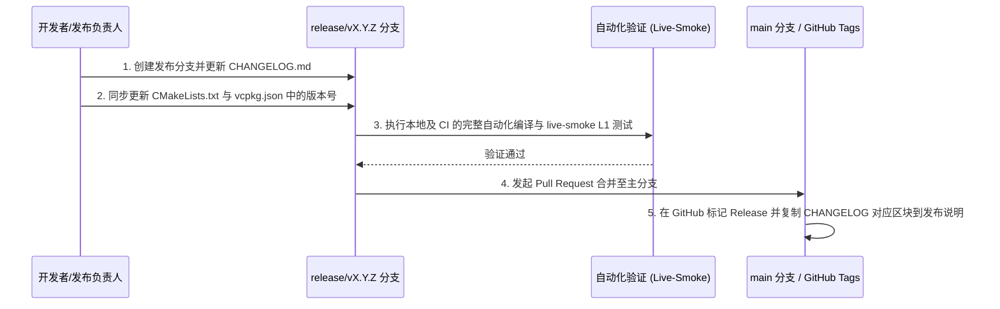

# 变更日志（Changelog）编写与维护规范

> 当前仓库版本阶段为 `v0.3.0`，版本号来源于 [路线图](../02-roadmap.md) 的 v0.3 当前基线；仓库当前没有 0.1/0.2/0.3 的历史 tag 序列。正式发布前，变更日志必须从该基线开始补齐可追溯发布记录。

本文档定义了 UBAA Next 项目的变更日志（Changelog）管理策略。所有开发人员在提交涉及公共 API、网络协议、平台集成或安全性变更的修改时，必须严格遵守本规范，确保变更可追溯且与语义化版本（SemVer 2.0.0）高度协同。

---

## 1. 核心设计原则

UBAA Next 项目的变更日志维护遵循以下三条黄金原则：
1. **面向使用者设计**：变更日志是为了让应用壳层（如 ArkTS 鸿蒙 UI、未来的 Slint 桌面 UI）以及终端系统集成人员快速理解变更，而非简单的 Git Commit 历史复制。禁止直接将 `git log` 内容堆砌在变更日志中。
2. **严格对应语义版本**：每一次发布的版本号变更，必须在变更日志中存在清晰明了、边界确定的更新区块。
3. **安全审计前置**：由于本项目涉及北京航空航天大学统一认证及校园敏感数据，任何涉及凭据存储、网络拦截器、调试日志和脱敏引擎（Redaction）的变更必须单独标记，并在变更日志中重点突出。

---

## 2. 变更分类标准（Keep a Changelog）

我们采用国际主流的 **Keep a Changelog** 标准。所有变更项必须归入以下六个标准分类之一：

* **`Added`（新增）**：
  新功能的引入。例如：增加了新的 C ABI 绑定接口、引入了新的平台级安全存储实现。
* **`Changed`（变更）**：
  现有功能的调整或优化。例如：网络超时机制重构、脱敏引擎的匹配模式升级。
* **`Deprecated`（废弃）**：
  即将在未来大版本（Major）中移除的不推荐使用的方法或特性。此分类用于提早预警下游消费侧。
* **`Removed`（移除）**：
  在当前版本中彻底删除的特性或接口。
* **`Fixed`（修复）**：
  对已知缺陷、系统崩溃、内存泄露或解析异常的修复。
* **`Security`（安全）**：
  漏洞修复、加密算法升级、防止敏感调试信息或原始凭据（Username/Password/Cookie/Token）泄露的底层逻辑强化。

---

## 3. 变更日志条目编写规范

每一个写入变更日志的条目，必须包含以下要素，并以规范的 Markdown 格式书写：

```markdown
- [模块/平台] 变更的具体描述。说明为什么要做此项变更，以及它对下游开发者的直接影响。
  - **影响说明**：[可选] 如果涉及 ABI 或编译选项变化，必须在此说明。
  - **安全审计**：[安全类变更必填] 说明脱敏或加密的防护提升，并附带离线验证情况。
```

### 3.1 编写规范示例：
```markdown
### Added
- [Bindings/C] 增加了 `ubaanext_ygdk_records` C ABI 接口，用以拉取阳光打卡记录。
- [Platform/Windows] 实现了基于 Windows Credential Manager 的安全凭据存储，彻底替代先前的 volatile 内存保存方案。

### Security
- [Core/Net] 强化了 `CookieJar` 序列化时的脱敏审计。任何离线 dump 操作都将强制剥离 `authorization` 与原始会话 `ticket`。
  - **安全审计**：经 L1 级 live-smoke 本地回归测试验证，脱敏覆盖率为 100%，无泄漏风险。
```

---

## 4. 版本发布工作流（Changelog Sync Lifecycle）

版本发布时的变更日志更新及同步操作必须严格遵循以下执行链：



### 4.1 核心发布前置清单
在正式向 `main` 分支提交发布 PR 并打 Tag 之前，必须执行以下自检：
1. **版本号对齐**：确保 `CMakeLists.txt` 中的 `project(UBAANext VERSION X.Y.Z)` 与 `vcpkg.json` 中的 `"version-string": "X.Y.Z"` 完美一致。
2. **变更内容归集**：确认在当前版本更新区块中，所有的 `Added`/`Changed`/`Fixed` 等信息已完整涵盖，没有遗漏。
3. **三方许可校验**：如果在当前版本引入了新的三方库（修改了 `vcpkg.json` 或 `cmake/`），必须同步在变更日志中说明，并更新 `docs/licensing/third-party-notices.md`。

---

通过严格且高标准地执行此变更日志策略，UBAA Next 可以极大地提升跨团队协作效率，减少由于 C ABI 变化引发的平台外壳（ArkTS / Slint）编译与集成故障，保障核心系统的稳健更迭。
