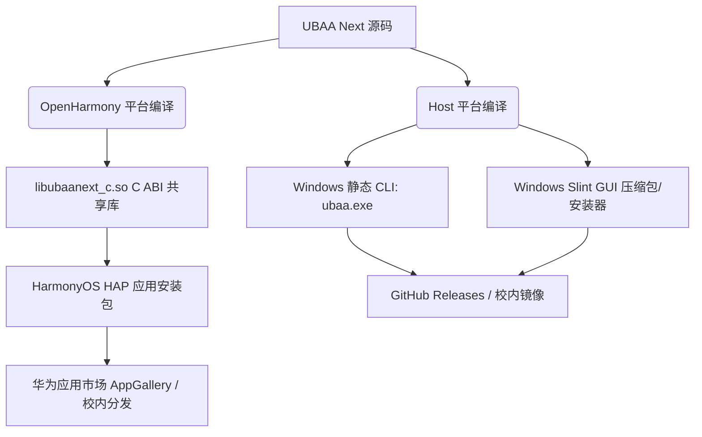

# UBAA Next 多平台分发与交付计划

本文档详细规划了 UBAA Next 项目在 Windows（命令行客户端与未来 Slint 图形界面）和 HarmonyOS（鸿蒙 Stage 模型应用）平台上的编译输出、打包封装、分发渠道及安全校验策略，确保软件分发过程合规、高效且具备高抗风险能力。

---

## 1. 跨平台分发版图与目标形态

UBAA Next 是一个采用“C++ 原生核心 + 平台级外壳”架构的校园客户端，其分发矩阵根据不同的使用场景和目标受众进行了定制化设计：



### 1.1 Windows CLI（命令行客户端 `ubaa.exe`）
* **定位**：面向极客学生、开发者、自动化脚本和系统测试人员。
* **分发形态**：单文件绿色版二进制可执行文件 `ubaa.exe`。
* **分发渠道**：GitHub Releases 页面、北航内网开源镜像站。

### 1.2 Windows GUI（图形界面客户端 `ubaa-gui.exe`）
* **定位**：面向普通桌面的 Windows 用户。
* **分发形态**：包含 `ubaa-gui.exe`、必要 Slint 资产文件、THIRD-PARTY-NOTICES 及使用说明的压缩包（`.zip`），或微型 Windows 安装包（`.msi`）。
* **分发渠道**：GitHub Releases 页面。

### 1.3 HarmonyOS App（鸿蒙客户端 HAP）
* **定位**：北航师生日常移动端校园服务主入口。
* **分发形态**：Stage 模型 `.hap` 应用安装包（内嵌 `arm64-v8a` 架构的 `libubaanext_c.so` 共享库）。
* **分发渠道**：华为应用市场（Huawei AppGallery）、校内受控 Beta 分发渠道。

---

## 2. 编译与打包策略

为了确保打包产出具备最高的便携性和稳定性，项目在各个平台制定了极高要求的编译策略：

### 2.1 Windows 平台：纯静态链接保障
为杜绝“动态链接库缺失（DLL Hell）”异常，Windows CLI 默认实施以下打包规则：
1. **静态链接三方库**：在 CMake 构建中引入 vcpkg 静态三方库 triplet（如 `x64-windows-static`），将 `libcurl`、`OpenSSL`（`libssl` 和 `libcrypto`）直接静态编译进 `ubaa.exe`。
2. **静态链接 MSVC 运行时（CRT）**：配置 `CMAKE_MSVC_RUNTIME_LIBRARY` 为 `MultiThreaded`（在 Release 下），确保可执行文件完全不依赖目标机器上的 `vcruntime140.dll` 等外部 C++ 运行库。
3. **输出精简**：剥离所有符号表（通过 `cmake --build --config Release` 执行 `/DEBUG:NONE` 或启用 `/RELEASE`），生成无多余调试依赖的独立运行程序。

### 2.2 HarmonyOS 平台：双端版本对齐
鸿蒙 HAP 的构建由单独的鸿蒙仓库配合 DevEco Studio 进行，但必须遵守以下依赖对齐规范：
1. **SO 模块打包**：生成的 `libubaanext_c.so` 必须放入 HAP 工程的 `libs/arm64-v8a/` 目录下。
2. **版本协同矩阵（Versioning Matrix）**：
   HAP 的发布版本号与所内含的 UBAA Next C++ SDK 版本号必须严格记录。例如：
   * **HAP v0.6.0** (应用层版本号，用于应用市场)
   * **Embedded C++ Core SDK v0.3.0** (C ABI 内核版本号，可由 `ubaanext_version()` 运行时读取并在关于页面展示)
3. **剔除冗余**：HAP 的 NAPI 依赖层仅编译 `entry/src/main/cpp` 目录下的胶水代码，严禁将 CLI 的 `main.cpp`、Catch2 测试套件或 Host 端的 Mock 配置打入安装包。

---

## 3. 分发安全与合法性校验

考虑到北航校园网客户端的安全属性，软件在发布分发阶段执行严格的安全认证：

### 3.1 散列值校验（Hash Verification）
* 在 GitHub Releases 发布任何 Windows 二进制文件（`ubaa.exe` 或 GUI 压缩包）时，必须在发布日志中同时公布该二进制文件的 **SHA-256 校验和**。
* **自动化生成脚本**：在 CI 发布流水线中，通过 PowerShell 自动生成散列列表：
  ```powershell
  Get-FileHash -Algorithm SHA256 .\build\windows-ninja-msvc-release\apps\cli\ubaa.exe
  ```

### 3.2 数字签名（Digital Signing）
* **Windows 客户端**：在具备条件的情况下，使用自签名的 CA 证书或社区受信任数字证书对 `ubaa.exe` 进行代码签名，以减少 Windows Defender 的误报提示。
* **鸿蒙 HAP 签名**：所有发布的 `.hap` 包必须使用华为官方开发者中心生成的**发布证书（Release Certificate）**和**发布 Profile** 进行签名，确保真机能够正常安装并安全运行。

### 3.3 敏感路径与调试信息脱敏
在分发构建之前，编译脚本必须执行强制检查，防止开发机上的绝对路径（如 `D:\Code\Cpp\...`）作为调试字符串硬编码写入二进制文件中（可通过开启编译器的相对路径转换选项，如 `/FC` 在 MSVC 中的受控清理，或在 GCC/Clang 中使用 `-fdebug-prefix-map`）。

---

## 4. 自动更新与版本探针机制

为了便于后续的校园网络协议升级，UBAA Next 设计了内建的版本更新探针：

1. **版本查询接口**：
   客户端在发起请求时，提供只读接口（如 CLI 命令 `ubaa version`，或 GUI 的“检查更新”按钮），向项目 GitHub API 提交安全的 HTTPS 请求以获取最新的 `tag_name`。
2. **渐进式降级设计（Graceful Degrade）**：
   如果客户端处于内网或完全无外网连接状态，更新探针必须**优雅退化**，以静默或本地提示方式处理失败，绝不允许阻塞客户端的核心业务流。
3. **版本探针合规**：
   更新检查绝对禁止在未经用户明确同意的前提下，收集和上传任何学生个人隐私数据（包括但不限于学号、当前 Cookie、设备 IP）。

---

通过上述严密的分发与打包规划，UBAA Next 能够以最高安全标准、最轻量化的形态将校园服务聚合客户端送达最终用户手中，并保持在多平台下的合规性与高可维护性。
