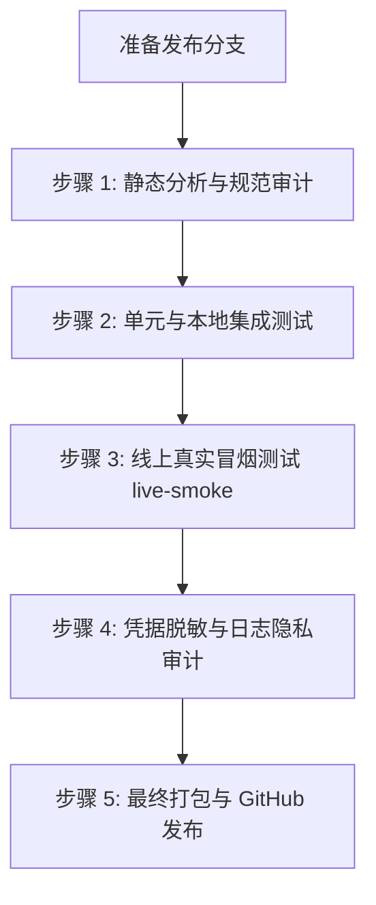

# GitHub Release 发布前验证与自动化检查清单

> 当前仓库版本阶段为 `v0.3.0`，但尚未形成正式 tag 发布序列。本清单用于未来从当前路线图基线发起正式发布；示例版本号应在发布时替换为实际 tag。

本文档为 UBAA Next 项目发布新版本（Tag Release）时的标准操作程序（SOP）。旨在通过严格的静态分析、单元测试、线上冒烟测试（Live Smoke）及隐私脱敏审计，确保每一个对外发布的包体都具备工业级稳定性和极高的信息安全防护水平。

---

## 发布核验流程总览



---

## 步骤 1：静态分析与编译合规审计

在进行任何功能性测试前，必须确保源码符合项目的代码风格与静态合规标准：

1. **代码格式校验**：
   运行 PowerShell 格式化工具以确保代码完全符合 [`.clang-format`](file:///d:/Code/Cpp/UBAANext/.clang-format) 标准：
   ```powershell
   .\tools\format.ps1
   ```
2. **静态代码分析（Clang-Tidy）**：
   运行 Clang-Tidy 进行安全及代码质量审计，确保不包含内存泄漏、未初始化变量或越界风险。参考 [`.clang-tidy`](file:///d:/Code/Cpp/UBAANext/.clang-tidy) 配置文件。
3. **跨平台编译消警（Zero Warnings）**：
   * **Windows 平台**：在 MSVC 编译器下编译 Debug 与 Release 目标，要求 **零警告、零错误**。
   * **OpenHarmony 平台**：设置 `OHOS_NATIVE_HOME` 指向对应 Native SDK，执行编译 Preset：
     ```powershell
     $env:OHOS_NATIVE_HOME="C:\Users\ROG\AppData\Local\Huawei\Sdk\openharmony\native"  # 替换为实际 SDK 路径
     cmake --preset openharmony-clang-debug
     cmake --build --preset openharmony-clang-debug
     ```
     确保编译通过，未引入依赖冲突。

---

## 步骤 2：自动化单元与离线集成测试

1. **运行 Catch2 本地测试**：
   执行 CMake 预设的 CTest 测试集，验证核心协议解析和离线 mock 数据的行为逻辑：
   ```powershell
   ctest --preset windows-ninja-msvc-debug
   ```
   **合格标准**：所有测试用例（Test Cases）必须 **100% 通过（Passed）**，不允许存在任何忽略（Skip）或已知未修复的失败项。

---

## 3. 步骤 3：线上真实环境冒烟测试（Live Smoke）

为了验证在真实北航校园网环境下的网络协议可用性，必须运行 [`tools/live-smoke.ps1`](file:///d:/Code/Cpp/UBAANext/tools/live-smoke.ps1) 脚本进行线上环境回归测试：

### 3.1 环境变量配置
在执行冒烟脚本前，必须在本地环境中配置必要的环境变量（**严禁将这些配置写入代码库或提交至 Git**）：
```powershell
$env:UBAANEXT_LIVE = "1"                              # 显式启用线上冒烟测试
$env:UBAANEXT_USERNAME = "你的北航学号"               # 真实测试账号
$env:UBAANEXT_PASSWORD = "你的教务密码"               # 真实测试密码
$env:UBAANEXT_CLI_PATH = ".\build\windows-ninja-msvc-debug\apps\cli\ubaa.exe" # 待测试 CLI 二进制路径
$env:UBAANEXT_CONNECTION_MODE = "direct"              # 可选：direct（直连）或 vpn（WebVPN）
```

### 3.2 运行冒烟脚本（L1 级只读验证）
执行线上冒烟脚本（默认级别为 L1）：
```powershell
.\tools\live-smoke.ps1 -Level L1
```
* **L1 行为**：拉取用户个人主页（Whoami）、学期列表、课程表、考试安排、成绩清单、聚合待办列表、阳光打卡历史记录以及图书馆座位预约情况。
* **合格标准**：脚本无未处理异常；所有未显式 skip 的读取命令必须通过，否则 runner 必须以非 0 退出。全部读取命令通过时，脚本退出码为 `0`。

### 3.3 L2/L3 级写入操作验证
涉及远程状态改变的真实写操作命令（如今日打卡提交、图书馆座位真实锁定等）：
1. **写操作安全门槛**：线上自动冒烟脚本**默认不执行任何真实写操作**，以避免弄脏测试账号的线上真实状态。
2. **手动操作规范**：若需要验证 L2（写操作）或 L3（破坏性写操作）行为，必须由开发者手动运行对应的 CLI 命令行（例如使用 `--confirm` 或 `--yes` 参数），并配置：
   ```powershell
   $env:UBAANEXT_ALLOW_WRITE = "1"
   $env:UBAANEXT_CONFIRM_WRITE = "1"
   ```
3. 验证完毕后，必须手动撤销在线上造成的测试订单或预约，最大程度保护教务系统数据纯净。

---

## 步骤 4：凭据脱敏与日志隐私审计（极重要）

由于 `live-smoke.ps1` 运行时会将部分命令的输出打印在控制台上，在发布包体前，必须确保敏感凭据没有发生泄漏。

1. **自动脱敏机制审计**：
   检查 [`tools/live-smoke.ps1`](file:///d:/Code/Cpp/UBAANext/tools/live-smoke.ps1) 的脱敏输出逻辑。脚本内建的 `Redact-Text` 函数会对终端打印的数据进行强力正则脱敏，包含以下匹配标识：
   * `username`、`password`、`token`、`cookie`、`ticket`、`session`、`captcha`、`authorization`
   * 绝对路径（形如 `C:\...` 或 `/data/storage/...`）
   * HTML 表单、敏感 URL 查询字符串（Query Strings）
2. **日志合规人工抽检**：
   手动查看冒烟测试在控制台打印的所有 JSON 或文本数据。必须确认所有被拦截的敏感字段值在输出中均已显示为 **`[REDACTED]`**。
3. **红线指标**：如果在任何一处的调试日志或终端输出中暴露出明文的 Cookie 字符、密码原文或 Token 字符串，**本次发布必须立刻中止**，修复脱敏代码后再重新走发布流程。

---

## 步骤 5：最终打包与 GitHub 发布发布

经过上述所有测试后，即可进入正式的分发发布步骤：

1. **合并代码并对齐版本**：
   * 将 `release/vX.Y.Z` 分支通过 PR 合并入 `main` 主分支。
   * 确认 `CMakeLists.txt` 中的项目版本号已更新为发布目标版本。
2. **Git 标记（Tagging）**：
   在本地主分支创建包含注释的 Git 标签，并将其推送到 GitHub：
   ```bash
   git tag -a vX.Y.Z -m "Release UBAA Next vX.Y.Z"
   git push origin vX.Y.Z
   ```
3. **Release 包体构建**：
   运行静态 Windows Release 预设以产生最终要交付的 `ubaa.exe`：
   ```powershell
   cmake --fresh --preset windows-ninja-msvc-release
   cmake --build --preset windows-ninja-msvc-release --target ubaa
   ```
4. **生成 Hash 校验和**：
   在打包目录下生成交付物的 SHA-256：
   ```powershell
   Get-FileHash -Algorithm SHA256 .\build\windows-ninja-msvc-release\apps\cli\ubaa.exe
   ```
5. **在 GitHub 上创建发布**：
   * 选择新推送的 Tag `vX.Y.Z`。
   * 发布标题格式为 `UBAA Next vX.Y.Z`。
   * 复制 `CHANGELOG.md` 中对应当前版本的最新更新日志内容至发布说明框内。
   * 在下方粘贴二进制可执行文件的 SHA-256 散列校验值。
   * 上传打包好的 `ubaa.exe` 二进制文件（若后续有图形界面，上传 `ubaa-gui-vX.Y.Z.zip`）。
   * 点击 **Publish release** 按钮，发布完成。
