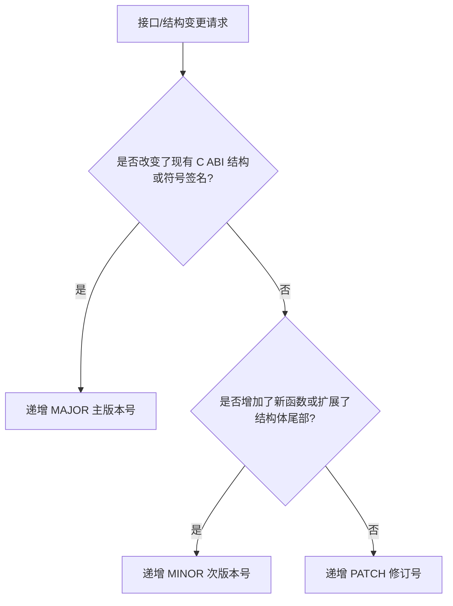

# 语义化版本（SemVer 2.0.0）与 C ABI 兼容性演进规范

> 当前仓库版本号为 `0.4.0`，与 [路线图](../02-roadmap.md) 的 `v0.4 — CLI 工程化` 同步。仓库当前没有 0.1/0.2/0.3 的历史 tag 序列；后续 bump 版本时必须同时更新 `CMakeLists.txt`、`vcpkg.json` 和发布记录。

本文档详尽规范了 UBAA Next 项目的语义化版本控制策略。鉴于本项目采用“C++ 跨平台核心 + C ABI 绑定接口”的架构设计，版本号的更迭不仅关系到源码级的兼容，更直接决定了二进制级别（Application Binary Interface, ABI）的稳定性。所有核心层及绑定层开发者必须严格遵循此规范。

---

## 1. 语义化版本 2.0.0 核心定义

UBAA Next 的版本号统一采用格式：**`MAJOR.MINOR.PATCH`**（主版本号.次版本号.修订号）。

* **`MAJOR`（主版本号）**：当引入破坏性变更、非向下兼容的 API 调整，或者导致现有 ABI 发生破裂（ABI Break）时递增。
* **`MINOR`（次版本号）**：当在 C ABI 接口层中引入向下兼容的新接口、新结构，或者在 C++ Core 中以兼容方式引入重大业务新功能时递增。
* **`PATCH`（修订号）**：当引入向下兼容的内部缺陷修复、性能优化、脱敏强化或纯粹的 C++ Core 内部重构（不改变任何对外导出的 C API 符号与结构定义）时递增。

---

## 2. 基于 C ABI 绑定的版本演进细则

在 [`bindings/c/include/UBAANext/Bindings/C/UbaaNative.h`](file:///d:/Code/Cpp/UBAANext/bindings/c/include/UBAANext/Bindings/C/UbaaNative.h) 中导出的 C API 是鸿蒙外壳和未来桌面 UI 外壳消费核心的唯一通道。其版本更迭规则定义如下：



### 2.1 主版本号递增条件（MAJOR - 破坏性 ABI 变更）
任何导致下游消费侧（如 ArkTS 鸿蒙应用、Slint 图形程序）重新编译失败、或者不经重新编译直接替换 `.so`/`.dll` 会引发内存越界、符号找不到或逻辑崩溃的变更，都必须递增 `MAJOR`：
1. **函数签名变更**：修改了现有导出 C 函数的入参类型、返回值类型或参数个数。例如修改登录接口：
   ```c
   // 旧版本：
   UBAANEXT_C_API const char *ubaanext_auth_login(UbaaNextContext *context, const char *username, const char *password, const char *captcha);
   // 新版本（增加了第二个密码字段）：
   UBAANEXT_C_API const char *ubaanext_auth_login(UbaaNextContext *context, const char *username, const char *password, const char *second_pw, const char *captcha);
   ```
2. **函数移除**：删除了已导出的 C 函数（例如移除了旧的 `ubaanext_terms`）。
3. **结构体破坏性变更**：
   * 在已有的 C 结构体（如 `UbaaNextCapabilities`）中间或头部插入了新字段，这会导致结构体成员偏移量（Offset）发生改变，下游程序访问旧字段时会读到脏数据甚至内存越界。
   * 删除了结构体中的任何字段。
   * 修改了结构体已有成员的类型（例如将 `uint8_t` 改为 `int32_t`）。

### 2.2 次版本号递增条件（MINOR - 向下兼容的功能扩展）
在不影响旧有二进制和源码级编译的前提下，引入新的接口或功能：
1. **新增导出函数**：在头文件尾部增加了全新的 `extern "C"` 导出函数。例如新增阳光打卡自动签到接口：
   ```c
   UBAANEXT_C_API const char *ubaanext_ygdk_auto_signin(UbaaNextContext *context);
   ```
2. **结构体向下兼容扩展**：
   * **仅允许在结构体尾端追加字段**，且必须确保分配新结构体内存时，下游不会发生缓冲区溢出（通常配合结构体大小探针或句柄隔离模式）。
   * 激活了预留字段。如果先前在 `UbaaNextCapabilities` 内部定义了 `uint8_t reserved[8];`，在次版本中将其中一个预留字节赋予具体业务含义，属于向下兼容的 MINOR 变更。

### 2.3 修订号递增条件（PATCH - 二进制完全等价的修复）
在不改动任何导出头文件（`UbaaNative.h`）、不改动导出函数声明与参数的前提下，仅对核心层 C++ 源码进行升级：
1. **内部 Bug 修复**：修复了 `ClassroomService.cpp` 中解析空闲教室 HTML 数据时的正则表达式缺陷。
2. **性能优化**：改进了 `HttpClient` 的连接复用和 HTTPS 缓存命中率。
3. **安全强化与脱敏升级**：升级了 `Redact-Text` 正则库，增加了对新型 Token 泄露的自动阻断，无任何 C ABI 变更。

---

## 3. ABI 稳定性保护与设计防御指南

为了最大程度推迟 `MAJOR` 版本的被迫递增，延长核心库接口的生命周期，开发者必须在 C API 设计中实施以下防卫性设计：

### 3.1 跨平台定宽类型约束
严禁在导出的 C API 接口中使用平台和编译器字长不确定、对齐不一致的原始类型（如 `long`、`unsigned int`、`size_t`）。必须无条件使用 C99 的定宽整型（来自 `<stdint.h>`）：
* 传布尔标志或单字节状态：统一使用 `uint8_t`。
* 传数值索引或页码大小：统一使用 `int32_t`。
* 传长度或 64 位整数：统一使用 `int64_t`。

### 3.2 不透明指针模式（Opaque Pointer / Handle）
对于包含复杂 C++ 内部状态的对象（如会话上下文 `UbaaNextContext`），严禁在 C 头文件中暴露其结构体成员。
无条件采用**不透明指针**声明：
```c
typedef struct UbaaNextContext UbaaNextContext; // 仅前置声明，隐藏具体 C++ 实现
```
所有针对该上下文的操作，必须通过传入该指针的导出函数完成（如 `ubaanext_context_create()` 与 `ubaanext_context_release()`）。这确保了核心层 `UbaaNextContext` 的内部结构体成员无论如何变化，下游 ABI 始终稳如磐石。

### 3.3 显式结构体对齐与填充防卫
如果必须在 C ABI 接口层分发明文结构体（如平台能力结构体 `UbaaNextCapabilities`），在设计之初就必须加入填充字节以备未来扩展：
```c
typedef struct UbaaNextCapabilities {
    uint8_t real_network;
    uint8_t secure_cookie_persistence;
    uint8_t cookie_persistence;
    uint8_t redirect_control;
    uint8_t openssl_crypto;
    uint8_t secure_store;
    uint8_t app_data_path;
    uint8_t upload_bytes;
    uint8_t live_login;
    uint8_t write_operations;
    
    // 显式保留 14 字节的预留空间，用以应对未来 MINOR 版本的零破坏性扩展
    uint8_t reserved[14]; 
} UbaaNextCapabilities;
```

### 3.4 动态版本探针校验
下游应用外壳在动态加载 `libubaanext_c.so` 或 `ubaanext.dll` 时，应首先调用 `ubaanext_version()` 导出函数，校验返回的版本字符串是否与外壳编译期的预期 MAJOR 版本一致，发现冲突时立刻 fail-closed，杜绝因 ABI 错配引发的未定义行为（Undefined Behavior）。

---

本规范是 UBAA Next 二进制生命周期管理的核心宪章。凡涉及修改 `UbaaNative.h` 文件的 Merge Request，必须经过 ABI 兼容性特别同行审查方可合并。
