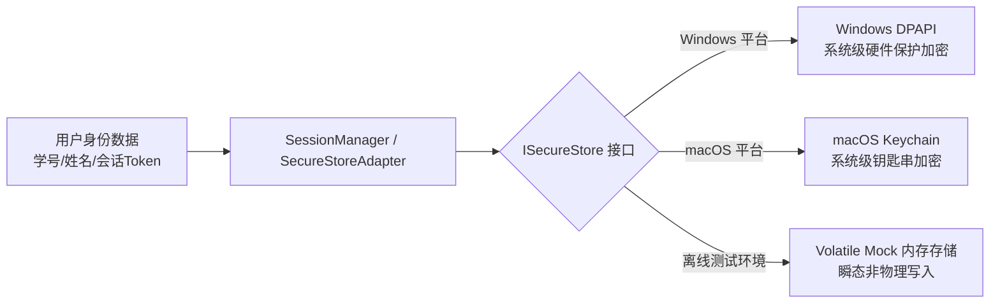

# UBAANext 去中心化客户端隐私政策草案

本隐私政策草案阐明了 UBAANext 客户端应用在处理、存储和传输用户个人数据与敏感身份凭证时的原则、安全机制及数据生命周期。

UBAANext 团队深知隐私与安全对于高校用户的重要性，本系统在架构设计上彻底杜绝了任何形式的中心化数据收集行为。

---

## 1. 去中心化架构与直连通信原则

UBAANext 采用完全去中心化（Decentralized）、本地优先（Local-Only）的软件架构：

* **无中转服务器**：系统不设任何云端中转服务器、日志收集服务器或辅助认证网关。
* **数据流直连**：客户端运行期间的所有网络流量，均直接从用户本机物理终端发往北京航空航天大学的官方网络基础设施，具体包括：
  * 统一身份认证中心（`sso.buaa.edu.cn`）
  * 统一数据平台（`uc.buaa.edu.cn`）
  * 各下游系统（如 `byxt.buaa.edu.cn`、`iclass.buaa.edu.cn`、`gsmis.buaa.edu.cn`）
  * 或者，在校外环境通过官方的 WebVPN 网关（`d.buaa.edu.cn`）进行端到端加密数据传输。
* **物理链路封闭**：除用户本机与上述北航官方服务器之间的直连加密通信外，任何数据均不会被发送给任何第三方实体或 UBAANext 的开发者。

---

## 2. 敏感凭证的零日志、零采集政策

为了保障用户的身份资产安全，客户端代码在数据摄入与处理阶段实施了严格的**“凭证不落地、日志不记录”**的零宽容政策：

* **非持久化临时凭证**：用户的登录密码、验证码响应体（CAPTCHA Response）仅以高度瞬态的内存变量（In-Memory Variables）形式存活于 HTTPS 请求发送的前后瞬时阶段，绝不向本地文件系统进行任何持久化写入。
* **脱敏日志规范**：
  * 在 [AuthService.hpp](file:///d:/Code/Cpp/UBAANext/core/include/UBAANext/Auth/AuthService.hpp) 和 [SessionManager.hpp](file:///d:/Code/Cpp/UBAANext/core/include/UBAANext/Auth/SessionManager.hpp) 中有严格的架构规范：所有敏感输入（如 username, password）和会话边界（如 session.access_token）绝对禁止写入应用的任何普通错误日志（Logs）、诊断信息（Diagnostics）或调试控制台输出中。
  * 对网络层错误的捕获会通过 `redact_url_query` 等工具剔除请求参数中的 Ticket 票据、会话 ID，防止通过 Trace Log 泄露活跃会话的访问权限。

---

## 3. 本地数据生命周期与平台安全存储 (ISecureStore)

为了让用户在重新启动应用时无需重复输入密码，系统提供了持久会话保存功能。所有会话状态的管理皆处于严格的本地生命周期控制之下。



### 3.1 本地存储的会话键设计
当会话被持久化时，只有以下字段会被写入底层的安全键值数据库中：
* `session.username`：登录学号
* `session.student_id`：账户学号标识
* `session.display_name`：展示姓名
* `session.access_token`：JWT 访问令牌（如适用）
* `session.refresh_token`：JWT 刷新令牌（如适用）
* `session.connection_mode`：连接模式（Direct / WebVPN）
* `session.active`：激活标记 `"true"`

### 3.2 抽象安全存储 subsystem (ISecureStore) 与平台加密
会话持久化并不使用明文的普通配置文件，而是通过抽象安全接口 `ISecureStore` 衔接平台级高保密性安全存储：
* **平台安全硬件加密**：
  * **Windows 平台**：系统实现类使用 **Windows DPAPI**（Data Protection API），利用当前 Windows 用户的登录凭证在操作系统核心层对敏感字符串进行物理加密，其他普通用户或未授权进程无法解密读取。
  * **macOS 平台**：使用 **Keychain Services**，将令牌与敏感键存储于系统的安全钥匙串中，受系统沙箱和硬件安全芯片保护。
* **安全警告（Mock/Fallback 边界）**：
  * 离线测试的 Mock 实现（`MockSecureStore`）仅将键值对保存在瞬态内存的 `std::map` 中，随测试进程终止立即自然销毁，绝对禁止以明文形式持久化输出到任何物理磁盘文件中。
  * 在任何平台移植中，未经安全模块授权，系统严禁退化为以明文 JSON/XML/INI 文件的形式将敏感令牌或密码存盘。

---

## 4. 会话安全销毁与物理清除机制 (Logout Lifecycle)

当用户执行退出登录（Logout）或会话失效时，系统立即执行严格的数据销毁逻辑以防范会话残留和未授权访问：

* **存储物理擦除**：调用 `AuthService::logout()` 或 `SessionManager::clear_session()` 时，系统将按键逐一调用底层安全存储的 `remove()` 接口，将 `session.username`、`session.student_id`、`session.display_name`、`session.access_token`、`session.refresh_token`、`session.connection_mode` 以及激活状态标记从操作系统的物理安全存储中彻底抹除。
* **双向 Flush 机制**：擦除完成后，立即强制触发 `m_store.flush()` 动作，让底层的存储修改在磁盘介质上实时生效，杜绝因进程意外崩溃导致清除动作未能持久存盘的安全隐患。
* **内存垃圾清理**：在应用内存空间中，将敏感缓存指针与变量进行显式清空与重置：
  ```cpp
  m_current.reset(); // 清空内存缓存的账户 Model
  m_username.clear(); // 清空内存中的临时用户名
  m_connection_mode.clear(); // 清空连接模式缓存
  m_session.clear(); // 物理重置内存 Session 结构体
  ```

---

## 5. 主机重定向安全边界防御 (Host Redirect Security Boundary)

在执行 CAS SSO 认证及重定向链追踪过程中，为了防止恶意服务器通过中间人劫持、DNS 污染或恶意 location 响应头对用户的敏感 SSO Cookie 或 Ticket 进行凭证窃取，客户端在 [AuthService.cpp](file:///d:/Code/Cpp/UBAANext/core/src/Auth/AuthService.cpp) 中构建了物理安全边界：

* **白名单主机域匹配（SSO Whitelist Host Filter）**：
  在 `follow_redirects` 方法中，每次跳转的目标 URL（Location）必须先提取主机域并调用 `is_allowed_redirect_url` 进行评估：
  * **合法规则**：重定向的主机（Host）必须精确等于 `buaa.edu.cn`，或者以 `.buaa.edu.cn` 结尾（例如 `sso.buaa.edu.cn`、`uc.buaa.edu.cn` 等官方授信域名）。
  * **阻断动作**：一旦检测到重定向地址不在授信白名单域名中（例如重定向到了钓鱼网站或未授权的外部 API 网关），系统将立即无条件阻断当前的重定向执行链，静默丢弃任何后续跳转，并向控制层抛出 `ErrorCode::NetworkError`，提示“拒绝不安全的重定向地址”。
* **防止跨协议降级**：
  所有的重定向目标 URL 必须强制为 `https://` 协议，拒绝任何未加密的明文 `http://` 重定向跳转，确保数据在传输层受到高强度的 TLS 加密保护。
